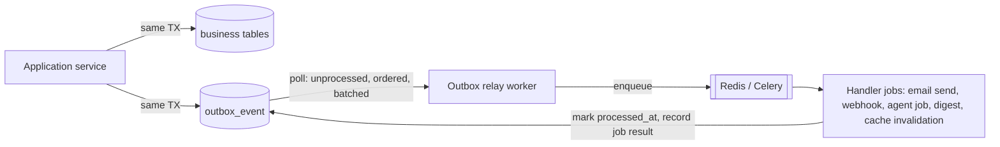
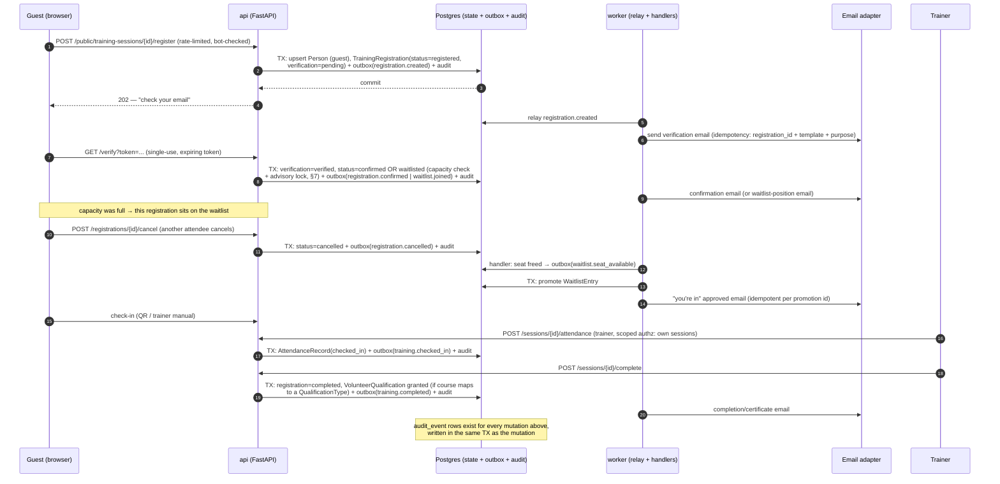

# Data Flow & Eventing

How data and events move through the platform: the synchronous request path, the
transactional outbox that bridges into async side effects, idempotency at every
replayable boundary, the durable event catalog, and where Redis (cache/locks) fits.

## 1. The synchronous request path

Every write follows one shape. There are no shortcuts around it — not for admin
screens, not for MCP tools, not for workers.

```
HTTP request (or MCP tool call, or worker job)
  → route / tool handler          (thin: parse, validate shape — Pydantic)
  → authorize(user, action, res)  (org match → scoped role → permission → object check)
  → application service           (business logic; owns the transaction boundary)
  → repository (org-scoped base)  (all queries filtered by org_id — enforced, not remembered)
  → single DB transaction: state change + outbox_event(s) + audit_event
  → commit → response
```

Rules that make this safe:

- **Org scoping is structural.** The repository base class requires an `OrgContext`
  and appends `WHERE org_id = :ctx_org` to every query. A repository method that
  could bypass it (`unscoped()`) exists only in the platform-admin break-glass path
  and emits an audit event on use. A missing scope is a bug, never a silent leak.
- **Services own transactions.** Routers never open sessions; repositories never
  commit. One service call = one transaction = one consistent unit containing the
  state change, its outbox events, and its audit event. If any part fails, all of
  it rolls back — there is no state change without its event, and no event without
  its state change.
- **No side effects inside the transaction.** No SMTP, no HTTP to providers, no S3
  writes inside the DB transaction. Side effects happen only in workers, driven by
  outbox events. (Object uploads use presigned URLs + a finalize call, see
  integrations.md.)
- **Read path** is the same minus the write: authorize → service → org-scoped
  repository → response. Heavy/public reads may be served from cache (§7).

## 2. The transactional outbox

The core consistency mechanism (system-design §3). The problem it solves: "DB
committed but the email/webhook/agent job was lost" (or the inverse — email sent
for a rolled-back registration).



Mechanics:

- `outbox_event` columns: `id`, `org_id`, `event_type`, `aggregate_type`,
  `aggregate_id`, `payload` (JSONB, versioned schema), `idempotency_key` (unique),
  `occurred_at`, `processed_at`, `attempts`, `last_error`.
- The **relay** is a dedicated worker loop: `SELECT ... WHERE processed_at IS NULL
  ORDER BY id LIMIT n FOR UPDATE SKIP LOCKED`. `SKIP LOCKED` lets multiple relay
  instances run without double-dispatch; per-aggregate ordering is preserved because
  events for one aggregate are serialized by `id`.
- Delivery to handlers is **at-least-once**. Exactly-once is achieved at the
  *handler*, via idempotency keys (§4) — never assumed from the transport.
- Failures: exponential backoff on `attempts`; after N attempts the event is parked
  (`dead` state) and surfaced in observability (queue depth, oldest-unprocessed-age
  alert). Parked events are replayable by an org admin action (audited).
- Payloads carry **ids, not documents**: handlers re-read current state through the
  org-scoped repository so they act on truth, not on a stale snapshot. The exception
  is compliance snapshots (rendered email content), which are first-class rows
  (`email_recipient`), not event payloads.

## 3. First-slice walkthrough: training registration, end to end

The full lifecycle of the first slice, showing every outbox hop. Every step's write
is one transaction (state + outbox + audit); every email is a side effect of an
event, never a synchronous call.



Notes on the tricky steps:

- **Capacity vs waitlist decision** (step "verify") runs under a per-session Redis
  advisory lock (`lock:session:{id}:capacity`) so two concurrent verifications
  cannot both take the last seat. The DB also carries a defensive constraint
  (confirmed-count check) so the lock is a latency optimization, not the safety net.
- **Waitlist promotion is deterministic code** (position order + promotion policy
  snapshot on the `WaitlistEntry`) — an explicit non-goal to use AI here.
- **Cancellation → promotion is two transactions**, connected by events. Between
  them the seat is briefly "free but unclaimed"; that window is fine (eventual
  consistency, §8) and always converges because the `waitlist.seat_available`
  handler is retried until it succeeds or parks.

## 4. Idempotency

Every boundary that can replay is keyed. Concretely:

| Boundary | Key | Dedup mechanism |
|---|---|---|
| Outbox relay → queue | `outbox_event.idempotency_key` | unique index; relay marks `processed_at` |
| Worker job (email send) | `(recipient_id, template, purpose)` or explicit `send_key` | `email_recipient` row is the dedup record — a second run finds it already `sent` and no-ops |
| Worker job (promotion, qualification grant) | aggregate id + transition | state-machine guard: transition already applied → no-op, log, exit 0 |
| Inbound webhook (Stripe) | provider `event.id` → `payment_event.idempotency_key` | unique index; duplicate insert → 200 OK, no side effects |
| Inbound webhook (email delivery) | provider message-id + event type | same pattern on `email_delivery_event` |
| Public API mutations (guest register) | client `Idempotency-Key` header (optional) + natural key `(session_id, person email)` | duplicate registration returns the existing record, 200 not 409 |

The rule: **replay must be safe and boring.** Any handler that cannot answer "what
happens if I run twice?" with "nothing new" does not ship.

## 5. Durable domain event catalog

The canonical `event_type` values (brief §8, mirrored in system-design §4). Each is
a versioned schema in `shared/events/`; producers and the module that owns each are
fixed — modules subscribe to each other's events, never reach into each other's tables.

| Event | Producer module | Primary consumers |
|---|---|---|
| `registration.created` | training | communications (verify email), reporting |
| `registration.cancelled` | training | training (seat-free handler), reporting |
| `waitlist.seat_available` | training / scheduling | training/scheduling (promotion handler) |
| `training.completed` | training | people (qualification grant), communications, reporting |
| `qualification.expiring` | people (scheduled scan) | communications (reminder), reporting |
| `shift.understaffed` | scheduling (scheduled scan) | communications, agents (proposal drafts) |
| `shift.changed` | scheduling | communications (affected signups), calendar feeds |
| `volunteer.checked_in` | scheduling / training | reporting, hours pipeline |
| `work_request.created` | maintenance | communications (triage notice), agents (triage draft) |
| `maintenance.overdue` | maintenance (scheduled scan) | communications, reporting |
| `donation.completed` | donations (webhook reconciliation) | communications (receipt), reporting |
| `payment.failed` | donations | communications (donor notice), finance report |
| `communication.approved` | communications | communications (scheduler) |
| `communication.scheduled` | communications | communications (send pipeline) |
| `communication.sent` | communications | reporting |
| `delivery.failed` | communications (provider webhook) | communications (suppression), observability |

Catalog rules: adding an event = a schema file + an entry here + a consumer test.
Renaming an event is a breaking change and goes through an ADR. Consumers must
tolerate unknown *additional* fields (forward-compatible payloads).

## 6. Digest generation

Digests (coordinator daily/weekly summaries: new registrations, understaffed shifts,
overdue maintenance, pending approvals) are **pull-computed, push-delivered**:

1. `scheduler` (Celery beat) fires `digest.generate` per org per cadence, honoring
   the org timezone from `OrganizationSetting`.
2. The digest job **queries current state** through org-scoped repositories (it does
   not replay events — events trigger, state is truth) bounded by
   `last_digest_cursor` per (org, digest type, recipient role scope).
3. Empty digest → no email (no "nothing happened" noise).
4. Rendering + recipient resolution goes through the communications module like any
   campaign: `email_recipient` snapshot rows, suppression respected, delivery via
   the provider adapter, idempotent on `(digest_run_id, recipient_id)`.
5. The cursor advances only after the digest run commits, so a crashed run re-covers
   the same window (safe: recipient-level dedup catches the overlap).

## 7. Redis: cache and locks (and what it is never used for)

Redis is **ephemeral infrastructure** — losing it must never lose data. It serves:

- **Queue transport** for Celery (jobs are re-derivable from the outbox; a flushed
  Redis means re-relay, not loss).
- **Cache** (read-through, TTL + event-driven invalidation):
  - public content pages, published training catalog, opportunity lists
    (`cache:{org}:public:*`, invalidated by publish/change events);
  - resolved permission sets per (user, org) — short TTL (60s) + invalidation on
    `UserRoleAssignment` change; authorization *decisions* are never cached, only
    the role/permission resolution input;
  - rate-limit counters and bot-control state for public forms.
- **Locks** (SET NX PX, short TTL, lock token verified on release):
  - `lock:session:{id}:capacity` — seat allocation / waitlist promotion (§3);
  - `lock:shift:{id}:capacity` — same pattern for shift signups;
  - `lock:campaign:{id}:send` — a campaign send pipeline runs exactly one instance;
  - beat-job mutexes so overlapping scheduled scans don't double-fire.
- Cache keys are **always org-prefixed**; a cross-org cache hit is treated as the
  same severity as a cross-org query.

Never in Redis: source-of-truth state, outbox events, audit, anything whose loss
would be observable to a user beyond a latency blip.

## 8. Consistency guarantees

What callers and operators may rely on:

1. **Strong consistency inside one request.** A committed API response reflects a
   fully applied transaction: state + outbox + audit, all or nothing.
2. **No lost side effects.** If state changed, its events exist durably in Postgres.
   Side effects happen eventually even across worker/Redis outages (at-least-once
   relay + idempotent handlers ⇒ effectively-once side effects).
3. **No phantom side effects.** Side effects fire only from committed events; a
   rolled-back registration can never produce an email.
4. **Eventual consistency between modules.** Cross-module reactions (promotion,
   qualification grant, digests, cache invalidation) lag by relay latency (target
   p95 < 5s; alert on oldest-unprocessed-age > 60s). UI copy is written for this
   ("confirmation email on its way"), never pretending synchrony.
5. **Per-aggregate ordering.** Events for one aggregate are relayed in commit order.
   No global ordering guarantee across aggregates — handlers must not assume it.
6. **Invariants live in the database.** Capacity limits, unique registration per
   (session, person), org FK integrity are constraints, not just application checks.
   Locks reduce contention; constraints guarantee correctness.
7. **Audit is transactional, not best-effort.** An audited action without its
   `audit_event` row cannot exist, because they commit together.
8. **Org isolation is absolute** across every path in this document — request,
   worker, event handler, cache, digest. No event is ever consumed across orgs.
