# Domain Model

## Rules
1. **Every org-owned record carries `org_id`** (FK → `organization`). The repository base
   enforces the filter; a missing scope is a bug.
2. **Explicit relations for business state.** JSONB only for extensible form definitions,
   provider metadata, and custom-field *values* under governance — never core state.
3. **Snapshots for compliance:** a `form_submission` stores the exact `form_version`; an
   `email_recipient` stores the rendered content sent; a `donation` stores the provider
   event id. History is append-only where it matters.
4. **Person vs User vs VolunteerProfile are distinct.** A *Person* is a human record
   (may exist from a guest registration with no login). A *User* is an authenticable
   identity that links to a Person. A *VolunteerProfile* is the volunteer-operational
   overlay on a Person. This separation is what makes guest→volunteer conversion clean.

## Core ERD (grouped)

```mermaid
erDiagram
  ORGANIZATION ||--o{ CHAPTER : has
  ORGANIZATION ||--o{ PROGRAM : has
  ORGANIZATION ||--o{ LOCATION : has
  ORGANIZATION ||--o{ ORGANIZATION_SETTING : configures
  PROGRAM ||--o{ TEAM : has

  PERSON ||--o| USER : "may authenticate as"
  PERSON ||--o| VOLUNTEER_PROFILE : "may have"
  USER ||--o{ USER_ROLE_ASSIGNMENT : holds
  ROLE ||--o{ USER_ROLE_ASSIGNMENT : grants
  ROLE ||--o{ ROLE_PERMISSION : includes

  VOLUNTEER_PROFILE ||--o{ VOLUNTEER_QUALIFICATION : has
  QUALIFICATION_TYPE ||--o{ VOLUNTEER_QUALIFICATION : instances
  ONBOARDING_PIPELINE ||--o{ ONBOARDING_STAGE : contains
  VOLUNTEER_PROFILE ||--o{ ONBOARDING_RECORD : progresses

  COURSE ||--o{ TRAINING_SESSION : offers
  TRAINING_SESSION ||--o{ TRAINING_REGISTRATION : enrolls
  PERSON ||--o{ TRAINING_REGISTRATION : registers
  TRAINING_REGISTRATION ||--o| ATTENDANCE_RECORD : produces
  TRAINING_SESSION ||--o{ WAITLIST_ENTRY : queues

  EVENT ||--o{ SHIFT : schedules
  SHIFT ||--o{ SHIFT_ROLE : needs
  SHIFT_ROLE ||--o{ SHIFT_SIGNUP : filled_by
  VOLUNTEER_PROFILE ||--o{ SHIFT_SIGNUP : takes
  SHIFT ||--o{ WAITLIST_ENTRY : queues
  VOLUNTEER_PROFILE ||--o{ VOLUNTEER_HOUR_ENTRY : logs

  EMAIL_TEMPLATE ||--o{ EMAIL_CAMPAIGN : basis
  EMAIL_CAMPAIGN ||--|| EMAIL_AUDIENCE_DEFINITION : targets
  EMAIL_CAMPAIGN ||--o{ EMAIL_RECIPIENT : resolves
  EMAIL_RECIPIENT ||--o{ EMAIL_DELIVERY_EVENT : reports
  OUTBOX_EVENT }o--|| ORGANIZATION : scoped

  ASSET ||--o{ WORK_REQUEST : subject_of
  ASSET ||--o{ MAINTENANCE_SCHEDULE : has
  WORK_REQUEST ||--o{ WORK_ASSIGNMENT : assigns
  ASSET ||--o{ INSPECTION : inspected

  FORM_DEFINITION ||--o{ FORM_VERSION : versions
  FORM_VERSION ||--o{ FORM_SUBMISSION : captures

  DONATION_CAMPAIGN ||--o{ DONATION : receives
  DONATION ||--o{ PAYMENT_EVENT : reconciled_by

  AGENT_RUN ||--o{ AGENT_PROPOSAL : produces
  AGENT_PROPOSAL ||--o| APPROVAL_REQUEST : may_require
  MCP_CLIENT ||--o{ MCP_TOOL_INVOCATION : calls
  AUDIT_EVENT }o--|| ORGANIZATION : scoped
```

## Entities by module (key fields; all org-owned rows include `org_id`, `created_at`, `updated_at`)

### org & identity
- **Organization** — name, slug, branding, timezone, locale, status.
- **OrganizationSetting** — key/value + typed config; **feature flags**, terminology map,
  scheduling/retention policies, enabled modules.
- **Chapter / Program / Team / Location** — the configurable hierarchy (labels overridable).
- **User** — auth identity; email, auth methods (magic-link/password), MFA state, `person_id`.
- **Person** — name, contact points (email/phone, verified flags), consent links. May exist
  without a User (guest).
- **Role**, **Permission**, **RolePermission**, **UserRoleAssignment** — RBAC; assignment is
  **scoped** (org / program / team / location).

### people (volunteer)
- **VolunteerProfile** — `person_id`, status (configurable), availability summary, interests,
  skills, staff-notes visibility flags, workload counters.
- **Interest**, **Skill** — configurable tag catalogs.
- **QualificationType** — name, issuing rule, validity period, prerequisite of what.
- **VolunteerQualification** — profile + type, granted_at, expires_at, source (training/manual).
- **OnboardingPipeline / OnboardingStage** — configurable per org.
- **OnboardingRecord** — profile progress through stages, blockers, completed docs.
- **AvailabilityRule** — recurring availability windows/preferences.
- **ConsentRecord** — purpose, granted/withdrawn, timestamp, channel.
- **Document** — uploaded/generated file ref (S3 key), type, expiry, visibility.

### training
- **Course** — title, description, prerequisites (→ QualificationType), default capacity,
  cost, accessibility info, cancellation policy, public/internal.
- **TrainingSession** — course instance: start/end, timezone, location (phys/virtual),
  capacity, instructor, status.
- **TrainingRegistration** — session + **person** (guest-capable), status
  (registered/confirmed/waitlisted/cancelled/attended/completed/no_show), verification state,
  source, payment ref (if paid).
- **AttendanceRecord** — check-in time, method (QR/manual), completion, certificate ref.
- **WaitlistEntry** — polymorphic (session|shift), position, promotion policy snapshot.

### scheduling (shared model)
- **Event** — a container: one-time / recurring / project / maintenance window / admin.
- **Shift** — start/end, timezone, location, min/max staffing, recurrence rule,
  setup/travel buffer, status.
- **ShiftRole** — role name, capacity, eligibility (required QualificationTypes / age /
  program rules).
- **ShiftSignup** — role + volunteer, status, check-in, no_show, hours.
- **VolunteerHourEntry** — profile, source (shift/maintenance/manual), hours, approval state.

### communications
- **EmailTemplate** — name, subject, html+text bodies, declared variables (+validation), footer.
- **EmailDraft / EmailCampaign** — status (draft→review→approved→scheduled→sending→sent/
  paused/failed/cancelled), template, schedule (tz-aware), approval refs.
- **EmailAudienceDefinition** — the **explicit, previewable** query (filters + counts) — the
  audience is a first-class record, never implicit.
- **EmailRecipient** — resolved person + rendered content snapshot + status.
- **EmailDeliveryEvent** — delivered/bounce/complaint/open/click/unsubscribe (open/click opt-in).
- **SubscriptionPreference** — per-topic/program/location/urgency opt-in; suppression.
- **OutboxEvent** — durable domain event (shared kernel), idempotency key, processed_at.

### content
- **ContentPage** — slug, blocks, state (draft/review/scheduled/published/archived/expired),
  author, approver, publish/expire, audience/location targeting, revision history.
- **Update** — title, summary, body, audience, channels, author, approver, publish/expire,
  urgency, related {event|program|location|task}, revision history.

### maintenance
- **Asset** — registry: type, location, identifiers, QR/short-code, service history link.
- **MaintenanceSchedule** — recurrence, checklist, next_due.
- **WorkRequest** — asset/location, category, severity, impact, attachments, status
  (configurable: reported→needs_triage→approved→scheduled→in_progress→blocked→waiting_parts→
  waiting_vendor→ready_for_verification→closed / rejected|duplicate), due, required skills/parts.
- **WorkAssignment** — owner/team, resolution notes, evidence, hours.
- **Inspection** — checklist results, pass/fail, follow-up work link.

### forms
- **FormDefinition / FormVersion** — draft/published versions; field types, validation,
  conditional sections (declarative), retention, role restriction.
- **FormSubmission** — the answers + **immutable `form_version` snapshot**, identified or
  anonymous, review state, attachments.

### donations
- **DonationCampaign** — goal, designations, suggested amounts, public progress flag.
- **Donation** — amount, one-time/recurring, designation, donor (person, optional anonymous),
  provider intent id, receipt state, consent link.
- **PaymentEvent** — provider webhook: type, signature-verified, idempotency key, reconciled.

### governance
- **AuditEvent** — actor (user/service/agent), action, target, before/after digest, org, time.
- **AgentRun / AgentProposal / ApprovalRequest** — the agent control plane (see agents/).
- **MCPClient / MCPToolInvocation** — governed MCP identity + call log.
- **IntegrationConfiguration** — provider config refs (secrets by reference, never inline).

## Migration plan
Alembic migrations, one per module bring-up, additive & reversible. Order:
`org+identity` → `people` → `programs` → `training` → `scheduling` → `communications+outbox`
→ `content` → `maintenance` → `forms` → `donations` → `governance`. The **first slice**
(training registration) needs only: org+identity, people (Person), training,
communications (template/outbox/recipient/delivery), audit, and minimal governance.
