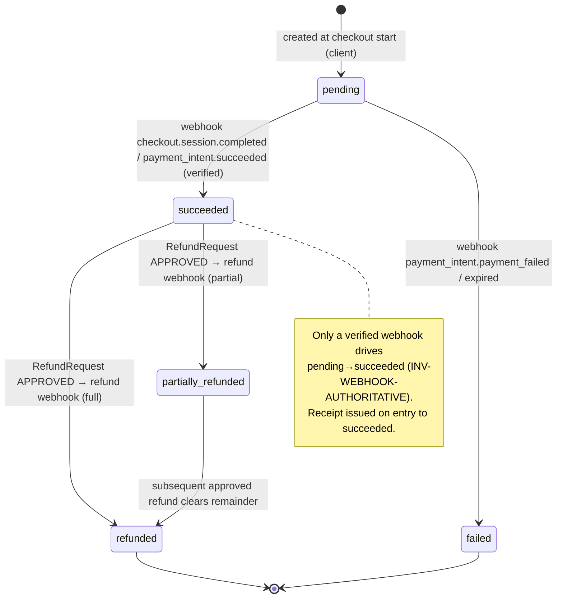

# Donations & Fundraising — Subsystem Design (PROPOSED)

> **Status: PROPOSED.** Everything in this document is a proposal for the Phase 6
> "Donations" slice (`phased-plan.md`). No code, migration, or table exists yet.
> This is a design deliverable — table sketches are illustrative, not final DDL.
> Where this design diverges from an existing doc, it is flagged **⚠ reconcile**.

## 1. Purpose & scope

A donations & fundraising subsystem for the Volunteer Operations Platform, landing
as a **new `app/modules/donations` module** (Phase 6; depends on Phases 1 and 4 —
public presence and communications/outbox). It lets an org run fundraising
campaigns, take one-time and recurring donations through **provider-hosted
checkout**, record in-kind gifts, issue immutable receipts, process
human-approved refunds, and report on fundraising — all org-scoped, audited, and
kept **separate from volunteer operational data by design**.

This is the highest-risk module in the platform: it handles money and donor PII,
and it is a documented magnet for abuse (threat-model.md T1, T7). The design is
therefore conservative and leans entirely on machinery that already exists —
`PaymentProvider` port (integrations.md §2), the transactional outbox
(`core/outbox.py`), audit (`core/audit.py`), rate-limiting/bot-checks
(`core/ratelimit.py`, `core/botcheck.py`), and the `OrgScopedRepository` tenant
boundary (`core/db.py`).

### 1.1 Invariants (non-negotiable — assert these in tests)

1. **INV-NO-PAN** — No PAN, CVV, expiry, magnetic-stripe, or raw card/token data is
   ever stored, logged, proxied, or placed in an outbox/audit payload. The platform
   holds only provider **intent/charge/event ids** and money **metadata** (amount,
   currency, status). Card entry happens on the provider's hosted surface. PCI scope
   stays with Stripe (current-state-audit.md **A3**; data-classification.md
   "Payment tokens / card data → Restricted — not stored").
2. **INV-WEBHOOK-AUTHORITATIVE** — A `Donation` reaches `succeeded` (or `refunded`)
   **only** from a signature-verified provider webhook reconciled server-side. The
   browser redirect back from checkout is UX only and never mutates money state
   (integrations.md §2; threat-model.md T7).
3. **INV-AGENT-NO-REFUND** — No agent may issue a refund or modify a financial
   record. `donation.refund` and `finance.modify` are **R4-PROHIBITED**
   (`agents/risk.py`). Refunds are human-approved, step-up-authenticated, audited.
4. **INV-DONOR-SEPARATION** — Donor financial identity is not conflated with
   volunteer operational identity. No volunteer-facing view, report, export, comms
   audience, or MCP tool exposes donation facts (data-classification.md §"Donor /
   volunteer separation").
5. **INV-ORG-SCOPED** — Every donations row is `org_id`-scoped through
   `OrgScopedRepository`; cross-org donation-id access returns 404, never a row from
   another org (`core/db.py` `get()`; threat-model.md T4).

## 2. Payment-provider abstraction

The subsystem depends **only** on the `PaymentProvider` port already declared in
`integrations.md §2` — the core donations domain never imports Stripe, never sees
card data, and never makes a network call on the request path (all outbound calls
run in workers, driven by the outbox). Restated abstractly:

```python
# integrations/payments/port.py  (PROPOSED — port already sketched in integrations.md §2)
class PaymentProvider(Protocol):
    def create_checkout(self, intent: DonationIntent) -> CheckoutRef:
        """Create a provider-HOSTED checkout/payment-intent for `intent`
        (amount minor-units, currency, one-time|recurring, org+campaign metadata,
        donation_id, idempotency_key). Returns a redirect URL / client secret.
        Card entry happens on the provider surface — INV-NO-PAN."""

    def verify_webhook(self, payload: bytes, signature: str) -> ProviderEvent:
        """Verify signature + timestamp/replay window over the RAW body BEFORE any
        parsing. Raise on failure. Returns a typed ProviderEvent(id, type, data)."""

    def refund(self, provider_charge_id: str, amount: Money,
               idempotency_key: str) -> RefundResult:
        """Issue a full/partial refund. Idempotent on `idempotency_key`."""
```

- **First adapter: `StripePaymentProvider` (test mode).** Stripe Checkout /
  PaymentIntents, hosted. Per integrations.md, **Stripe test mode _is_ the dev
  adapter** — a `FakePaymentProvider` exists only for unit tests/CI without network.
  Live-mode Stripe is a config switch, not new code.
- **Adapter chosen per org** via `IntegrationConfiguration` (secrets by reference:
  `STRIPE_SECRET_KEY`, `STRIPE_WEBHOOK_SECRET`; only the publishable key reaches the
  frontend). The domain resolves the adapter through the existing factory; it is
  never instantiated inline in a service.
- **v1 non-goal:** no non-Stripe provider. The port makes one addable later without
  touching the domain, but adding one is an ADR, not a v1 task.

## 3. Domain model (PROPOSED, org-scoped)

Conventions matched from `communications/models.py` and `scheduling/models.py`:
`Base` + `TimestampMixin`, `Mapped[...] = mapped_column(...)`, `str, enum.Enum`
status enums, `ForeignKey("organization.id")` + `index=True` on every `org_id`,
`UniqueConstraint` for natural keys, `JSON` columns for structured metadata.
Money is always **integer minor units + ISO-4217 currency** — never a float
(contrast `VolunteerHourEntry.hours: Float`, which is fine for hours, wrong for
money).

### 3.1 Entity overview & ownership boundaries

| Entity | Owns | Classification (data-classification.md) | Notes |
|---|---|---|---|
| `DonationCampaign` | goal, public page, dates, status | aggregates **Public** (opt-in), config **Internal** | Public progress widget |
| `Donor` | donor contact + consent | **Confidential** | Finance-module-owned; **separate from `Person`** (§3.9) |
| `Donation` | one gift, money state | **Confidential** (rows P3) | Money metadata only — INV-NO-PAN |
| `RecurringDonationPlan` | subscription schedule | **Confidential** | Provider subscription id |
| `InKindDonation` | non-cash gift | **Confidential** | No payment flow |
| `DonationReceipt` | immutable receipt | **Confidential** | Sequentially numbered per org/tax-year |
| `PaymentEvent` | verified provider webhook | **Confidential** (id/status only) | Idempotency + reconciliation ledger |
| `RefundRequest` | refund approval workflow | **Confidential** | Human-approved (INV-AGENT-NO-REFUND) |

All are reachable **only** through the donations module and only by
`finance.manage` / `finance.view` (and org admin). `Donation.provider_charge_id`
etc. carry no card data.

### 3.2 `DonationCampaign`

```
donation_campaign
  id                    PK
  org_id                FK organization.id, index          # INV-ORG-SCOPED
  slug                  str(160)                           # public page URL segment
  title                 str(200)
  description           Text
  goal_minor_units      int | None                         # None = open-ended
  currency              str(3)                             # ISO-4217
  status                CampaignStatus enum                # see below
  is_public             bool                               # public donate page live?
  publish_progress      bool                               # publish aggregate raised/goal?
  starts_at / ends_at   datetime | None
  designations          JSON  (list of {code,label})       # optional restricted funds
  suggested_amounts     JSON  (list[int minor-units])
  UniqueConstraint(org_id, slug)                           # public URL unique per org
```

`CampaignStatus(str, Enum)`: `draft → active → paused → closed → archived`.
Only `active` (and within `starts_at/ends_at`) accepts new donations. **Ownership:**
`finance.manage` / org admin create and manage campaigns; the public sees only
`is_public` campaigns and only the aggregates `publish_progress` permits.

### 3.3 `Donor` — donor identity, **separate from volunteer `Person`** (§3.9)

```
donor
  id                    PK
  org_id                FK organization.id, index
  display_name          str(200)                           # or "Anonymous"
  email                 str(320) | None                    # Confidential; redacted in logs
  phone                 str(40)  | None
  postal_address        JSON | None                        # receipts / tax compliance
  person_id             FK person.id | None                # OPTIONAL consented link (§3.9)
  consent_marketing     bool  default False                # stewardship email opt-in
  consent_source        str(80)                            # where/when consent captured
  is_anonymous_default  bool  default False
  UniqueConstraint(org_id, email)  # nullable email → partial index; anon donors have none
```

Owned by the donations module; `person_id` is a **nullable, consent-gated** pointer
(§3.9), never required, never traversed by volunteer-facing code.

### 3.4 `Donation` — one gift + money lifecycle

```
donation
  id                    PK
  org_id                FK organization.id, index
  campaign_id           FK donation_campaign.id, index
  donor_id              FK donor.id | None                 # None allowed for hard-anonymous
  amount_minor_units    int                                # integer minor units, never float
  currency              str(3)
  kind                  DonationKind enum                  # one_time | recurring
  status                DonationStatus enum                # pending→succeeded→refunded/failed
  is_anonymous          bool                               # hide donor on public/thank-you
  designation_code      str(40)  default ""                # restricted fund, optional
  recurring_plan_id     FK recurring_donation_plan.id | None
  # --- provider linkage (ids/metadata ONLY — INV-NO-PAN) ---
  provider              str(20)                            # "stripe"
  provider_intent_id    str(120) | None                    # checkout session / intent id
  provider_charge_id    str(120) | None                    # set on succeeded (refund handle)
  idempotency_key       str(200)                           # our key; sent to provider
  succeeded_at          datetime | None                    # set only by webhook reconcile
  UniqueConstraint(org_id, idempotency_key)                # dedupe donation creation
  Index(org_id, campaign_id, status)                       # reporting
```

`DonationKind(str, Enum)`: `one_time`, `recurring`. `DonationStatus(str, Enum)`:
`pending`, `succeeded`, `refunded`, `partially_refunded`, `failed`. **Lifecycle
governed by INV-WEBHOOK-AUTHORITATIVE** — see §4/§5 state diagram.

### 3.5 `RecurringDonationPlan`

```
recurring_donation_plan
  id                    PK
  org_id                FK organization.id, index
  campaign_id           FK donation_campaign.id
  donor_id              FK donor.id
  amount_minor_units    int
  currency              str(3)
  interval              PlanInterval enum                  # monthly | quarterly | annual
  status                PlanStatus enum                    # active | past_due | paused |
                                                           #   cancelled
  provider_subscription_id  str(120)                       # provider handle, no card data
  started_at            datetime
  cancelled_at          datetime | None
```

Each successful cycle is materialized as a `Donation` row (`kind=recurring`,
`recurring_plan_id` set) when the provider's recurring-charge webhook lands — so
volume/receipts/reporting treat every charge uniformly. A `payment_intent`/
`invoice.payment_failed` webhook flips the plan to `past_due` and emits
`donation.recurring_failed` (notify donor via outbox).

### 3.6 `InKindDonation` — non-cash gifts (no payment flow)

```
in_kind_donation
  id                    PK
  org_id                FK organization.id, index
  campaign_id           FK donation_campaign.id | None
  donor_id              FK donor.id | None
  description           Text                               # "20 boxes canned food"
  estimated_value_minor int | None                         # org's own valuation; not settled
  currency              str(3) | None
  received_at           datetime
  recorded_by_user_id   FK app_user.id                     # staff-entered
```

No provider, no webhook, no settlement. Receipts for in-kind gifts (where legal)
carry the **description**, not a platform-asserted value — valuation rules are the
org's responsibility. Manual creation is a privileged, audited action.

### 3.7 `DonationReceipt` — immutable, sequentially numbered

```
donation_receipt
  id                    PK
  org_id                FK organization.id, index
  donation_id           FK donation.id | None              # null for in_kind receipt
  in_kind_donation_id   FK in_kind_donation.id | None
  tax_year              int                                # bucketing for sequence
  sequence_no           int                                # per (org, tax_year), gapless
  receipt_number        str(40)                            # rendered, e.g. "2026-000123"
  issued_at             datetime
  snapshot              JSON                               # frozen: org legal name, donor
                                                           #   name+address, amount, date,
                                                           #   designation, tax statement
  UniqueConstraint(org_id, tax_year, sequence_no)
  UniqueConstraint(donation_id)                            # one receipt per donation
```

**Immutable:** never `UPDATE`d after `issued_at`. A correction is a new receipt
(and, if money changed, tied to a refund) — the original is retained. The
`snapshot` is a point-in-time copy so later edits to donor/org data don't rewrite
history (same pattern as `EmailMessage.body_text` snapshots). **Sequence
allocation** is per `(org_id, tax_year)` and must be gapless → allocated inside the
receipt-issuing DB transaction under a row lock on a per-org/tax-year counter
(details deferred; the invariant is: no gaps, no reuse, monotonic). **Legal
content** (charity registration number, "no goods/services provided" statement,
etc.) is **org-configured** and deferred — the design guarantees immutability,
numbering, and the snapshot; the org supplies the jurisdiction-specific fields.

### 3.8 `PaymentEvent` — verified webhook ledger (reconciliation source of truth)

```
payment_event
  id                    PK
  org_id                FK organization.id, index
  provider              str(20)
  provider_event_id     str(120)                           # Stripe event.id
  event_type            str(60)                            # checkout.session.completed, ...
  donation_id           FK donation.id | None              # resolved during reconcile
  status                str(30)                            # applied | ignored | unmatched
  payload_digest        JSON                               # id/amount/status ONLY, redacted
  received_at           datetime
  UniqueConstraint(org_id, provider, provider_event_id)    # INV: dedupe replays (T7)
```

Append-only. `payload_digest` stores **only** money metadata and ids — never card
data (INV-NO-PAN). This table is the reconciliation ledger threat-model.md T7
requires: dedupe on `provider_event_id`, never trust the webhook body for money
state without it.

### 3.9 Donor vs volunteer `Person` — why they must not be conflated

`domain-model.md` note 4 already separates `Person` / `User` / `VolunteerProfile`.
This design goes one step further and gives donations their **own `Donor` record**
rather than hanging donation facts directly off `Person`. Rationale:

- **Different lawful basis & retention.** Donor financial records retain for
  **7 years** (financial record-keeping); volunteer operational data anonymizes at
  **12 months inactive** (data-classification.md). Two clocks on one row is a
  compliance hazard — separate rows let each purge on its own schedule.
- **Different access ceiling.** Donation data is **finance-manager/org-admin only**;
  volunteer data is coordinator-visible. A shared identity row invites accidental
  join-through. Separation makes INV-DONOR-SEPARATION structural, not a query
  convention.
- **Donors need not be people-in-the-system.** A one-off anonymous public donor
  should never create a volunteer `Person`. Forcing that pollutes the volunteer
  pipeline (threat-model.md T1) and the acquisition metrics.
- **Optional consented linkage.** When the *same human* both volunteers and donates
  and **consents**, `Donor.person_id` may point at their `Person`. The link is
  one-directional and consent-gated: it enables a finance-only "this donor is also
  volunteer X" view, and **never** exposes donation facts to volunteer-facing
  surfaces. Comms audiences cannot filter volunteers by donation behavior (or vice
  versa) without an org-admin-approved, audited, sensitive-flagged campaign
  (data-classification.md §"Donor / volunteer separation").

> **⚠ reconcile** — `domain-model.md` §donations sketches `Donation.donor =
> person (optional anonymous)`, i.e. donor *is* a `Person`. This design proposes an
> intermediary `Donor` entity to make the retention/access separation structural. If
> accepted, update `domain-model.md` accordingly; if rejected, this section becomes
> "donation facts scoped by module+role on `Person`" instead. **This is a domain-model
> change → T3, reviewer + ADR before build.**

## 4. Webhook reconciliation (provider = source of truth)

The redirect from hosted checkout is UX only. Settlement is established **only** by
a signature-verified webhook, reconciled idempotently and replay-safe, exactly per
integrations.md §2 and threat-model.md T7/C-WEBHOOK.

```mermaid
sequenceDiagram
  participant Br as Browser
  participant Pr as Stripe (hosted)
  participant API as api (webhook route)
  participant DB as Postgres
  participant OB as Outbox/Worker

  Note over Br,Pr: Donor enters card ON PROVIDER surface — INV-NO-PAN
  Br->>API: POST /public/donations (amount, campaign, donor consent)
  API->>DB: create Donation(status=pending, idempotency_key)  [rate+bot checked]
  API->>Pr: PaymentProvider.create_checkout(intent)          [in worker/outbox]
  Pr-->>Br: hosted checkout URL → donor pays
  Br-->>API: GET /donate/return  (UX only — shows "processing", NEVER marks paid)

  Pr->>API: POST /webhooks/stripe  (event, Stripe-Signature)
  API->>API: verify_webhook(raw_body, sig)  → reject 401 if bad (before parse)
  API->>DB: INSERT PaymentEvent(provider_event_id) — UNIQUE
  alt duplicate event id (replay)
    DB-->>API: conflict → no-op
    API-->>Pr: 200 (already applied)
  else new event
    API->>DB: match to Donation; reconcile status → succeeded
    API->>OB: enqueue outbox: donation.succeeded (idempotency_key)
    API-->>Pr: 200
  end
  OB->>OB: relay_pending → issue receipt + thank-you email (idempotent)
```

Design rules:

1. **Verify before parse.** `verify_webhook(raw_body, signature)` checks the Stripe
   signature + timestamp tolerance window (5 min) over the **raw** body first. Bad
   signature → `401`, counted as an attack signal (C-WEBHOOK). No domain parsing of
   an unverified body.
2. **Endpoint does minimal work.** Verify → insert `PaymentEvent` → reconcile →
   `200`. The `UniqueConstraint(org_id, provider, provider_event_id)` makes replays
   a no-op (dedupe by provider event id). All side effects (receipt, email) go
   **through the outbox**, never synchronously in the webhook handler.
3. **Reconcile, don't trust the body for money.** Match the event to its `Donation`
   (via our `idempotency_key` / provider intent id in event metadata), then set
   status. For high-value/ambiguous events, the reconcile step may re-fetch the
   charge from the provider API rather than trusting the payload — plus a nightly
   beat job cross-checks still-`pending` intents against the provider and flags
   drift (integrations.md §2).
4. **Retries via existing machinery.** On a processing error the handler returns
   `5xx` so the provider retries; because insert-dedupe + reconcile are idempotent,
   retries converge. Downstream effects inherit the outbox's exactly-once-effect
   guarantee (`OutboxEvent.idempotency_key` unique) — replay storms degrade to
   no-ops (threat-model.md "Outbox as a safety property").
5. **Never succeed from the client redirect** (INV-WEBHOOK-AUTHORITATIVE). The
   `/donate/return` page reads current `Donation.status` and shows "processing" until
   the webhook lands; it has no write path to money state.

### Donation state machine



## 5. Receipts (async, immutable, numbered)

- **Trigger:** entry to `succeeded` enqueues `donation.succeeded` on the outbox. An
  idempotent handler allocates the next `(org, tax_year)` sequence, writes the
  immutable `DonationReceipt` with a frozen `snapshot`, then enqueues the receipt
  **email** (through the communications outbox/email provider — reusing
  `EmailMessage`/`EmailProvider`). Two outbox hops keeps receipt creation and email
  delivery independently retryable.
- **Idempotent:** the handler keys on `Donation.id`; `UniqueConstraint(donation_id)`
  on `donation_receipt` guarantees one receipt per donation under retries.
- **Immutable + numbered:** §3.7. Corrections issue a new receipt; originals stay.
- **Legal content deferred to the org** (§3.7) — the design owns immutability,
  gapless numbering, and the snapshot; jurisdiction-specific fields are org config.

## 6. Refunds (human-approved, agent-prohibited)

Refunds are a **high-risk action** (permissions.md; threat-model.md T7/C-MFA) and
`donation.refund` is **R4-PROHIBITED** for agents (`agents/risk.py`) — INV-AGENT-
NO-REFUND. Design:

```
refund_request
  id                    PK
  org_id                FK organization.id, index
  donation_id           FK donation.id, index
  amount_minor_units    int                                # ≤ remaining refundable
  reason                str(200)
  status                RefundStatus enum                  # requested | approved |
                                                           #   executing | completed |
                                                           #   rejected | failed
  requested_by_user_id  FK app_user.id
  approved_by_user_id   FK app_user.id | None
  idempotency_key       str(200)                           # sent to provider.refund()
  UniqueConstraint(org_id, idempotency_key)
```

Approval + audit path:

1. **Request** — a `finance.manage` user files a `RefundRequest` (`requested`).
   Filing is audited (`audit.emit(action="donation.refund_requested", ...)`).
2. **Approve** — approval is a **separate privileged action** requiring **step-up
   re-auth (C-MFA)**. Finance manager may issue refunds **with approval** (◐ in the
   capability matrix); org admin is ● (may self-approve). Separation of
   requester/approver is enforced where the org configures it. Approval audited
   (`donation.refund_approved`, before/after digest).
3. **Execute** — approval enqueues an outbox event; a **worker** calls
   `PaymentProvider.refund(provider_charge_id, amount, idempotency_key)` — never on
   the request path, never inside a DB transaction. The stored `idempotency_key`
   makes a crashed-worker retry reuse the same key (no double refund).
4. **Settle by webhook** — the resulting `charge.refunded` webhook reconciles the
   `Donation` to `refunded`/`partially_refunded` (§4) — money state changes on the
   webhook, consistent with INV-WEBHOOK-AUTHORITATIVE, not on the API call's return.
5. **Audit throughout** — every transition emits an `AuditEvent`; agents cannot
   reach any step (each maps to R4).

## 7. Authorization & tenancy

Proposed permissions (extend permissions.md capability matrix — **⚠ reconcile**:
add these action keys; the matrix already has "View donation records" and "Issue
refunds ◐ w/ approval" rows for Finance mgr / Org admin):

| Permission | Grants | Baseline roles |
|---|---|---|
| `donation.view` | read donations/donors/campaigns, finance reports | Finance mgr, Org admin |
| `donation.manage` | create/manage campaigns, record in-kind, request refunds | Finance mgr, Org admin |
| `finance.export` | run accounting CSV export | Finance mgr, Org admin |
| (refund approval) | approve a `RefundRequest` (step-up) | Finance mgr ◐ w/ approval, Org admin ● |

- **Server-side everywhere** via the central `authorize(user, action, resource)` —
  API dependency, worker jobs before side effects, and inside every MCP tool
  (permissions.md; C-AUTHZ). Frontend role-awareness is UX only.
- **Org-scoped** through `OrgScopedRepository`; a cross-org donation id returns 404
  (`core/db.py`; INV-ORG-SCOPED; T4). Org resolved from session, **never** from the
  request payload.
- **Least privilege / donor data audited.** Coordinators, trainers, comms managers
  get `○` on all donation capabilities. Read access to donor PII is finance/admin
  only and **read-logged** where it reaches donor identity (data-classification.md
  P3; threat-model.md T12 insider misuse).
- **MCP:** donation write/refund tools do not exist; read tools (if any) return
  aggregates only, never donor identity, and are subject to per-client allowlists
  (mcp-design.md; T9). No agent path to R4 actions.

## 8. Public surface

- **Public campaign page** (`/campaigns/{slug}`) — renders `is_public` campaigns;
  shows progress (`raised/goal`) **only** if `publish_progress` (P1 aggregate,
  small-cell suppression per metric-dictionary.md §7). No donor identities.
- **Public donate flow** (`/public/donations`) — anonymous donation supported
  (`is_anonymous` / hard-anonymous with `donor_id = NULL`). This is a multi-screen
  flow (amount → details/consent → hosted checkout → return) → **design with the
  `user-flows` skill before building UI.**
- **Abuse controls (mandatory — C-RATE, T1).** Reuse `core/ratelimit.py`
  (`allow(key, limit, window_seconds)`, keyed per-IP + per-form) and
  `core/botcheck.py` (`verify(token, remote_ip)` — Turnstile in prod, pass-through
  in dev) on the donate endpoint. This throttles **card-testing** specifically;
  Stripe Radar provides the provider-side layer. Confirmation emails go through the
  outbox with per-recipient dedup to prevent email-bombing.
- **INV-NO-PAN on the public path:** the API receives amount/campaign/consent and
  creates a `pending` `Donation`; card entry is on the provider's hosted page. The
  API never touches card fields.

## 9. Reporting & exports

Plugs into the platform reporting layer; definitions are **binding** from
metric-dictionary.md §7 (do not re-derive here):

- **Metrics:** Donation volume (`sum(amount, status=succeeded)`), Donor count
  (distinct donors; anonymous counted as donations, not donors), Average donation,
  Campaign performance (`succeeded volume ÷ goal`), Recurring donor count and
  **recurring MRR-equivalent** (active plans normalized to monthly), Failed
  recurring payments, Refunds, Donor retention. Refresh 15m (RT on campaign pages).
- **Privacy:** all donor-identifying **drill-downs are P3** (finance/admin, access
  audited); public widgets show only opted-in P1 aggregates. Reporting is a read
  model — an authorized viewer's drill-down goes through the **same** row/role
  authorization; no side door (metric-dictionary.md binding authorization rule).
- **Accounting export (CSV):** `finance.export`, org-scoped, one row per money
  event (donation succeeded / refund) with amount, currency, campaign, designation,
  date, receipt number, donor reference — **no card data** (INV-NO-PAN). The export
  action is audited and delivered as a time-limited authenticated download
  (same pattern as the data-subject export, data-classification.md §export).

## 10. Data separation, privacy & retention

- **Module + role separation (INV-DONOR-SEPARATION).** Donation facts live only in
  `app/modules/donations`, reachable only via `donation.view`/`donation.manage`.
  No volunteer-facing view/report/export/MCP tool joins the two audiences
  (data-classification.md §"Donor / volunteer separation").
- **Stricter classification.** Donor/donation data = **Confidential**, rows **P3**;
  card data = **Restricted — not stored**. Redact donor email in logs
  (`a***@example.org`); `AuditEvent`/`OutboxEvent`/`PaymentEvent` payloads carry
  ids + money metadata only (the audit redactor already strips `token`/`secret`).
- **Consent tracking.** `Donor.consent_marketing` + `consent_source`; stewardship
  email honors it at send time. Where the org uses the platform `ConsentRecord`
  model, recurring/marketing consent is recorded there (append-only). Withdrawal
  enforced via suppression at send time.
- **Retention.** Financial records **7 years** then purge/anonymize per jurisdiction
  (data-classification.md); on donor deletion, **anonymize** donation/receipt rows
  to "deleted donor #hash" rather than delete, to keep financial history true.
  Consent proof and hashed suppression survive deletion.
- **Extends the security docs** — this module adds threat surface already cataloged
  (T1 public-form/card-testing abuse, T7 webhook forgery/replay, T12 insider misuse
  of finance data). No new threat category; the mitigations above are the T7/T1/T12
  controls instantiated for donations.

## 11. Migration & rollout

- **New module** `app/modules/donations` (models, service, public + admin routes,
  outbox handlers, MCP read-only surface). Maps to **Phase 6 "Donations"**
  (phased-plan.md; depends on Phases 1 and 4). Exit criteria (from the roadmap):
  test-mode donation → receipt; webhook replay-safe; donor data separated from
  volunteer ops.
- **Alembic migration** adds the tables in §3 (not written here — design only).
- **Reconciliations required before build** (each a T3 gate): (a) `domain-model.md`
  donor-as-`Person` vs the proposed `Donor` entity (§3.9); (b) permissions.md action
  keys (§7). Both touch schema/contracts → reviewer subagent + ADR.

### v1 non-goals (explicit)

- **No stored card data — ever** (INV-NO-PAN), in test or live mode.
- **No non-Stripe provider** (the port allows one later; adding it is an ADR).
- **No agent-executed refunds or financial mutations** (INV-AGENT-NO-REFUND).
- **No complex pledge management** (multi-year pledges, pledge-to-payment
  reconciliation, matching-gift workflows) — out of v1.
- **No donor CRM / stewardship automation** beyond a single consented thank-you +
  receipt email and marketing-consent capture.
- **No cross-org or blended donor↔volunteer audiences** without an org-admin-
  approved, audited, sensitive-flagged campaign.
- **No invasive donor tracking** (open/click analytics) by default.
```
