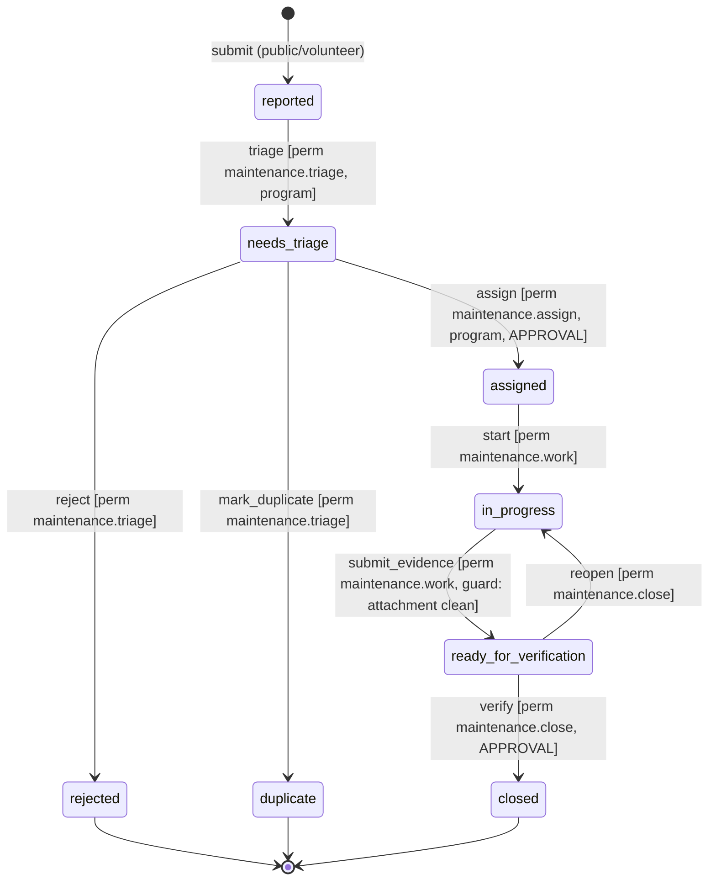

# Forms & Workflow Engine

> **Status: PROPOSED.** Nothing in this document is built yet. It specifies the
> `forms` and `workflows` modules named in `system-design.md §2` and the
> `FORM_DEFINITION → FORM_VERSION → FORM_SUBMISSION` entities sketched in
> `domain-model.md`. It lands in **Phase 5 (Maintenance & forms)** of
> `roadmap/phased-plan.md`. All table and column names below are proposals open
> to review, not committed schema.

## 1. Problem & thesis

The brief requires a *configurable workflow foundation rather than completely
separate implementations* for onboarding, incident/issue reports, maintenance
requests, reimbursements, feedback, and future org-specific processes. Each of
these is the same shape: **a structured form is submitted, it enters a state
machine, humans (and sometimes agents) move it through gated transitions, and
each transition audits + notifies.**

Thesis: build that shape once as two shared-kernel modules — `forms` (what is
collected) and `workflows` (how it moves) — so a new process is **configuration
(a FormDefinition + a WorkflowDefinition) instead of new code.** This mirrors how
`scheduling` already collapses events/projects/maintenance windows into one
shared model, and how `communications` treats an audience as data.

Two features already in the codebase are, in retrospect, hand-written instances
of this engine, and are the proof it is real (see §7):

- **Onboarding** — `people/service.py::activate_volunteer` is a workflow: a
  Person moves through `OnboardingStage`s with gated side-effects (grant
  qualifications, emit `volunteer.activate` audit).
- **Work requests** — `WorkRequest` in `domain-model.md` already has a
  hand-listed status machine (`reported → needs_triage → … → closed`). That
  status list *is* a `WorkflowDefinition`.

## 2. Scope & non-goals (v1)

**In scope (v1):**
- JSON-defined forms (field schema as data), immutably versioned.
- A declarative state-machine workflow bound to a subject record.
- Permission-gated transitions reusing `core.authz`.
- Transition side-effects via the transactional outbox + `AuditEvent`.
- Deadlines/escalations as Celery-beat jobs.
- Approval/review assignment.

**Explicit non-goals for v1 (do not build):**
1. **No visual drag-drop form builder.** Forms are authored as JSON via admin
   API; a builder UI is a later phase. Ship the engine first.
2. **No scripting language in forms or transitions** (matches `REQ-FORM-001`).
   Conditional logic is *declarative data* (`show_if`, `required_if`), evaluated
   server-side by a small fixed interpreter — never `eval`, never user code.
3. **No parallel / fork-join workflows, no sub-workflows, no timers-as-states.**
   v1 is a single linear-or-branching state machine per instance. Parallel
   approvals are modelled as multiple `ApprovalRequest`s against one state, not
   as concurrent states.
4. **No cross-org form sharing / marketplace.** Definitions are org-scoped;
   seeding a new org's forms is a Phase 8 import concern.
5. **No client-authoritative validation.** The browser may mirror rules for UX,
   but the server re-validates every field and re-evaluates every condition. The
   server is the only authority.

## 3. Domain model (proposed)

All tables follow repo conventions: `Base, TimestampMixin`, `Mapped[...] =
mapped_column(...)`, str-valued `enum.Enum` for status, `UniqueConstraint` for
natural keys, `ForeignKey("organization.id")` + `index=True` for `org_id`, JSON
for flexible-but-governed data. Every table is reachable only through an
`OrgScopedRepository` subclass.

### 3.1 Forms

```
FormDefinition                      # the stable, org-scoped identity of a form
  id                PK
  org_id            FK organization, index          # tenant boundary
  key               str(80)                          # e.g. "incident_report"
  name              str(200)
  purpose           str(400)                         # documented collection purpose (REQ-FORM-003)
  default_visibility enum(public|volunteer|internal) # who may submit
  retention_days    int | null                       # data-retention policy hook
  status            enum(active|archived)
  UNIQUE(org_id, key)                                # mirrors uq_email_template_key

FormVersion                          # an IMMUTABLE published snapshot of the schema
  id                PK
  org_id            FK organization, index
  form_definition_id FK form_definition
  version           int                              # monotonic per definition
  status            enum(draft|published|retired)
  schema            JSON                             # the full field schema (see 3.2)
  published_at      datetime | null
  published_by_user_id FK app_user | null
  UNIQUE(org_id, form_definition_id, version)
```

**Immutable versioning strategy.** A `FormVersion` is append-only. `draft`
versions are editable; **`published` versions are frozen** — editing a published
form creates a *new* `FormVersion` (next `version`), never mutates the old row. A
`FormSubmission` stores `form_version_id` **and a full copy of `schema` into
`schema_snapshot`** (see 3.3). Storing the FK alone is insufficient because a
malicious or accidental raw update could still rewrite a "frozen" row; the
embedded snapshot means a submission is self-describing and audit-reproducible
even if the version row is later archived or the definition is deleted. This
satisfies `domain-model.md` rule 3 ("a `form_submission` stores the exact
`form_version`") and `REQ-FORM-002`. Snapshot cost is discussed in §9.

### 3.2 Field schema (JSON, not a table)

Fields live inside `FormVersion.schema` as structured JSON rather than a
`FormField` table. Rationale: fields are only ever read/written as a whole
version, never queried individually, and JSON keeps a version atomically
snapshottable. `domain-model.md` rule 2 explicitly blesses JSON for "extensible
form definitions." Shape:

```jsonc
{
  "fields": [
    {
      "key": "severity",
      "type": "select",                 // text|number|date|select|multiselect|
                                        // file|boolean|address|signature
      "label": "Severity",
      "options": ["low", "medium", "high", "critical"],
      "visibility": "internal",         // public|volunteer|internal  (per-field)
      "validation": {
        "required": true,
        "required_if": {"field": "is_injury", "eq": true},
        "regex": null, "min": null, "max": null
      },
      "show_if": {"field": "category", "eq": "safety"}   // conditional visibility
    }
  ]
}
```

- **Field types:** text, number, date, select, multiselect, file (upload),
  boolean, address, signature/consent. `file` values are object-storage keys
  (§3.3), never inline blobs.
- **Validation rules:** `required`, `regex`, `min`/`max`, and **conditional
  `required_if`** (a field becomes required based on another answer).
- **Conditional visibility:** `show_if` ("show field X if field Y = value").
  Evaluated **server-side** at submit time — a hidden field's value is discarded,
  and a `required_if` on a hidden field does not fire.
- **Per-field visibility class:** `public` / `volunteer` / `internal`. This is
  the serialization boundary of §5: an `internal` field never appears in a
  response served to a public or volunteer caller — not even as a null key.

### 3.3 Submissions

```
FormSubmission
  id                PK
  org_id            FK organization, index
  form_definition_id FK form_definition
  form_version_id   FK form_version                  # which version was filled
  schema_snapshot   JSON                             # frozen copy of that version's schema
  submitter_person_id FK person | null               # null = anonymous (public form)
  submitter_user_id   FK app_user | null
  answers           JSON                             # {field_key: value}, validated
  status            enum(draft|submitted|under_review|accepted|rejected|withdrawn)
  workflow_instance_id FK workflow_instance | null   # set when a workflow is bound
  created_at, updated_at

FormSubmissionAttachment                             # file-upload references
  id                PK
  org_id            FK organization, index
  submission_id     FK form_submission
  field_key         str(80)                          # which file field
  object_key        str(400)                         # S3/MinIO key — NOT a blob
  filename          str(255)
  content_type      str(120)
  size_bytes        int
  scan_status       enum(pending|clean|infected|error)  # malware-scan gate (§9)
```

Files are references to S3/MinIO objects (matches `Document` in `domain-model.md`
and the storage box in `system-design.md §1`). Upload validation and malware
scanning are deferred to `security/threat-model.md` (§9) — the engine only
records `object_key` + `scan_status` and refuses to advance a workflow past a
gate while any attachment is `pending`/`infected`.

### 3.4 Workflow definitions & instances

```
WorkflowDefinition                    # a reusable state machine, org-scoped
  id                PK
  org_id            FK organization, index
  key               str(80)                          # e.g. "incident_report"
  name              str(200)
  subject_type      str(60)                          # "form_submission" | "volunteer_profile" | ...
  initial_state     str(60)
  states            JSON                             # [{name, is_terminal, sla_hours?}]
  transitions       JSON                             # see below
  status            enum(active|archived)
  UNIQUE(org_id, key)

# transitions entry (declarative, no code):
#   {
#     "name": "triage",
#     "from": "reported", "to": "needs_triage",
#     "permission": "maintenance.triage",           # authz permission required
#     "scope": "program",                            # org|program (fine-grained check)
#     "requires_approval": false,
#     "entry_actions": [{"emit_audit": "workrequest.triaged"},
#                       {"outbox": "workrequest.assigned_notice"}],
#     "guard": {"field": "severity", "neq": null}    # optional data precondition
#   }

WorkflowInstance                      # a live run bound to ONE subject
  id                PK
  org_id            FK organization, index
  workflow_definition_id FK workflow_definition
  subject_type      str(60)                          # denormalized from definition
  subject_id        int                              # e.g. a FormSubmission.id
  current_state     str(60)
  status            enum(open|closed)
  deadline_at       datetime | null                  # SLA for current_state (escalation)
  UNIQUE(org_id, workflow_definition_id, subject_type, subject_id)  # one live run per subject

WorkflowTransitionEvent               # append-only history
  id                PK
  org_id            FK organization, index
  workflow_instance_id FK workflow_instance
  transition_name   str(80)
  from_state        str(60)
  to_state          str(60)
  actor_type        str(20)                          # user|service|agent  (matches audit)
  actor_id          str(80)
  idempotency_key   str(200)  UNIQUE                 # dedup double-fire (§4.4)
  note              str(500)
  created_at

ApprovalRequest                       # generalizes the agents/ ApprovalRequest sketch
  id                PK
  org_id            FK organization, index
  workflow_instance_id FK workflow_instance
  transition_name   str(80)                          # the gated transition awaiting sign-off
  required_permission str(80)
  required_scope    enum(org|program)
  assignee_user_id  FK app_user | null               # explicit reviewer, or role-pool if null
  status            enum(pending|approved|rejected|expired)
  deadline_at       datetime | null                  # escalation clock
  decided_by_user_id FK app_user | null
  decided_at        datetime | null
```

`WorkflowInstance` binds to a subject polymorphically (`subject_type` +
`subject_id`) so the *same engine* drives a `FormSubmission` (incident,
reimbursement), a `VolunteerProfile` (onboarding), or a `WorkRequest`. The
`UNIQUE(subject)` constraint guarantees one live workflow per subject.

## 4. Workflow semantics

### 4.1 A transition is the only way state changes

`workflows.service.perform_transition(db, principal, instance_id,
transition_name, answers=None, note="")` is the single entry point. No route,
worker, or agent mutates `current_state` directly. Steps, all in **one DB
transaction**:

1. Load the instance via `OrgScopedRepository` (rejects cross-org — §6).
2. Find the transition whose `from == current_state` and `name` matches; 409 if
   none (illegal transition from this state).
3. **Authorize** (§4.2). Deny → `PermissionDenied`, audited as a denial
   (`REQ-X-003`).
4. Evaluate the transition `guard` against subject data; fail → 422.
5. If `requires_approval` and no matching `approved` `ApprovalRequest` exists,
   **create/return an `ApprovalRequest`** instead of moving — the state does not
   change (§4.5).
6. Apply `to` state, write a `WorkflowTransitionEvent` (with `idempotency_key`).
7. Run `entry_actions`: `audit.emit(...)` and `outbox.enqueue(...)` — **never a
   synchronous email/webhook** (§4.3).
8. Commit. The outbox relay (Celery worker) performs the actual side-effects
   later, idempotently.

### 4.2 Authorization reuses `core.authz` (never reinvented)

Each transition declares `permission` + `scope`. The service calls
`authz.require_scoped(db, principal, permission, program_id=<subject program>)`
when `scope == "program"`, else `authz.require(...)`. This is the exact
mechanism `permissions.md` mandates ("server-side authz on every protected op,
incl. workers + MCP"). A program-scoped coordinator therefore cannot triage a
work request in another program even if they hold the permission org-wide,
because `_covers()` in `authz.py` rejects it.

### 4.3 Side-effects go through audit + outbox

`entry_actions`/`exit_actions` may only do two governed things:
- `emit_audit` → `core.audit.emit(...)` in the same transaction (append-only
  trail with actor/action/target).
- `outbox` → `core.outbox.enqueue(...)` a domain event in the same transaction.
  Notifications (email a reviewer, notify a coordinator) are outbox event types
  with idempotent handlers, exactly like `communications`. **No email is sent
  inside the request** (`REQ-X-004`).

This means a transition is atomic: either the state moved *and* the audit row
*and* the outbox row all committed, or none did. No "state changed but
notification lost" and no "email sent but state rolled back."

### 4.4 Idempotency

A transition can fire twice (double-click, retried job, agent re-run). The
`WorkflowTransitionEvent.idempotency_key` (`UNIQUE`) is derived from
`{instance_id}:{from_state}:{transition_name}:{request_nonce}`. A second attempt
hits the unique violation and is treated as a no-op returning the already-moved
instance. Outbox handlers are independently idempotent via
`OutboxEvent.idempotency_key` (already enforced in `outbox.py`). Together this
gives exactly-once *effects* on at-least-once *delivery*.

### 4.5 Approvals, deadlines, escalations

- **Approval:** a `requires_approval` transition creates an `ApprovalRequest`
  routed to an `assignee_user_id` or (if null) any user holding
  `required_permission` in `required_scope`. The instance waits. When a reviewer
  calls `perform_transition` again with an `approved` request, it proceeds.
- **Deadlines/escalations run as Celery-beat jobs**, not inline. A periodic
  `workflows.tasks.sweep_deadlines` scans `WorkflowInstance.deadline_at` and
  `ApprovalRequest.deadline_at` past due and enqueues escalation outbox events
  (reminder, escalate to coordinator). The sweep is idempotent (an escalation
  outbox key encodes the instance + deadline window) so a beat job that runs
  twice does not double-notify. This matches the "reminders/digests via beat"
  posture in `system-design.md §4` and ADR-0003.

### 4.6 State-machine diagram (incident report, illustrative)



Every arrow is one row in `WorkflowDefinition.transitions`; the labels are its
`permission`/`scope`/`requires_approval`/`guard` fields. Changing the process =
editing that JSON, not shipping code.

## 5. Authorization, tenancy & serialization

- **Every definition and instance is org-scoped.** `FormDefinition`,
  `FormVersion`, `FormSubmission`, `WorkflowDefinition`, `WorkflowInstance`,
  `ApprovalRequest` all carry `org_id` and are only reachable through
  `OrgScopedRepository` subclasses (`FormRepository(db, org_id)` etc.).
- **Cross-org rejection (concrete).** A caller submits `POST
  /forms/{id}/submissions` with a `form_definition_id` belonging to another org.
  `FormRepository(db, principal.org_id).get(id)` calls `OrgScopedRepository.get`,
  which loads the row and returns `None` when `row.org_id != self.org_id` (see
  `db.py` lines 75–80). The service raises 404 — the attacker cannot even
  distinguish "wrong org" from "does not exist." The forged id never reaches a
  workflow. No query in the module ever omits the `org_id` filter, so there is no
  path that leaks.
- **Field-level visibility on serialization.** Response schemas are built from
  the **caller's visibility class** (public / volunteer / internal, derived from
  authz), and any answer whose field `visibility` exceeds the caller's class is
  *omitted from the serializer*, not merely hidden in the UI. An anonymous
  incident reporter polling their submission sees the public fields only;
  reviewer notes stored as `internal` fields never serialize to them. This is the
  server-side twin of the onboarding constraint in `agent-permissions.md §4`
  ("never exposes reviewer notes to the candidate").
- **Approvals honor scope.** An `ApprovalRequest.required_scope == program` is
  only satisfiable by a reviewer whose grant covers that program (via
  `authz.authorize(..., program_id=...)`).

## 6. How existing features re-map onto the engine

This section is the proof the abstraction is real, not generic. Each maps to a
`(FormDefinition?, WorkflowDefinition)` pair with zero bespoke state code.

### 6.1 Onboarding (today: `people/service.py::activate_volunteer`)

- **Subject:** `VolunteerProfile` (not a FormSubmission — onboarding has no
  single form; it's document + stage gated).
- **WorkflowDefinition** `key="volunteer_onboarding"`, `subject_type="volunteer_profile"`:
  states `applied → email_verified → training_complete → activated`
  (from `OnboardingPipeline/OnboardingStage`).
- **Transitions:**
  - `verify_email` guard `person.email_verified == true` (the current
    precondition in `activate_volunteer`).
  - `activate`: `entry_actions` = grant qualifications for completed courses +
    `emit_audit "volunteer.activate"` — exactly what the current function does
    inline, now declarative. The identity-reconciliation logic (attach User to
    existing Person, idempotent) stays in `people` service as the transition's
    action handler; the engine orchestrates *when* it runs, `people` still owns
    *how*. Modules still talk through services, never each other's ORM
    (`system-design.md §2`).
- **Payoff:** stalled-pipeline detection (onboarding agent, R0) becomes a query
  over `WorkflowInstance.current_state` + `deadline_at`, not custom code.

### 6.2 Incident / issue report (new, Phase 5)

- **FormDefinition** `key="incident_report"`, `default_visibility=public`
  (`REQ-MAINT-001`, anonymous allowed): fields `category (select)`,
  `is_injury (boolean)`, `severity (select, internal, required_if is_injury)`,
  `description (text)`, `photos (file, multi)`, `reporter_contact (text, optional)`,
  `internal_notes (text, internal)`.
- **WorkflowDefinition** = the §4.6 diagram. Public submit creates a
  `FormSubmission` + a `WorkflowInstance` in `reported`; an outbox event notifies
  the maintenance coordinator. This is `REQ-MAINT-001`/`003` delivered as config.

### 6.3 Reimbursement (new, org-specific — the "other processes" case)

- **FormDefinition** `key="reimbursement"`, `default_visibility=volunteer`:
  fields `amount (number, min 0)`, `currency (select)`, `description (text)`,
  `receipt (file, required)`, `program (select)`.
- **WorkflowDefinition** `states: submitted → manager_review → finance_review →
  approved | rejected`. Both review transitions are `requires_approval=true` with
  different `permission`/`scope` (`reimbursement.approve_manager` at program
  scope, `reimbursement.approve_finance` at org scope) — a **two-step approval
  chain** with no new code, just two `ApprovalRequest`s in sequence. `approved`
  emits an outbox event to notify finance; the engine deliberately **does not
  move money** (that stays a human action per `agent-permissions.md §9.5`).

That a public anonymous incident report and a two-stage volunteer reimbursement
are the *same engine* with different JSON is the whole point.

## 7. AI-agent & MCP touchpoints

Workflow operations map onto the R0–R4 risk levels in `agents/risk.py` /
`agent-permissions.md`. The engine is where those gates are *enforced*, because a
transition's `requires_approval` + `permission` already encode the gate; an agent
gets **no privileged path** the engine doesn't give a human.

| Operation | Risk | Rationale |
|---|---|---|
| Read a submission / instance / history (scoped) | **R0** | Reporting & triage agents read only within requester scope. |
| Categorize / suggest severity on an incoming request | **R1 draft** | `maintenance.classify` is already R1 in `risk.py`. Agent writes a *proposed* triage, never the transition. |
| Update allowlisted triage fields | **R2** | Only if the org allowlists it (matches maintenance agent's `workrequests.update_triage`, R2). |
| Draft a next-step / reminder message for a stalled instance | **R1** | Onboarding/comms draft; send stays R2 allowlisted-template only. |
| Perform an approval transition / close a work item | **R3 (approval-required)** | `work.close` is in `APPROVAL_REQUIRED` (`risk.py`). Agent may only create the `ApprovalRequest`; a human decides. |
| Reject a volunteer / delete a submission / expose internal fields | **R4 prohibited** | `agent-permissions.md §9`. The transition simply has no agent-invocable path. |

Enforcement point: when the actor is an agent (`actor_type="agent"`),
`perform_transition` classifies the transition's action via
`risk.classify_action` and **refuses to execute anything ≥ R3** — it records an
`AgentProposal`/`ApprovalRequest` instead. Confidence never changes the gate
(`agent-permissions.md` preamble). See `docs/agents/agent-permissions.md` for the
per-agent tool allowlists.

## 8. API surface (proposed, thin — routers delegate to services)

Routers contain no ORM queries (repo convention); they resolve the `Principal`,
call `forms.service` / `workflows.service`, and serialize with visibility
filtering (§5).

**Admin — definition CRUD** (permission `forms.admin` / `workflows.admin`):
- `POST /admin/forms` · `GET /admin/forms` · `GET /admin/forms/{id}`
- `POST /admin/forms/{id}/versions` (create draft) ·
  `POST /admin/forms/{id}/versions/{v}/publish` (freeze → published)
- `POST /admin/workflows` · `GET /admin/workflows` · `GET /admin/workflows/{id}`

**Public / volunteer — submission:**
- `GET /forms/{key}` — the *published* schema, visibility-filtered to the caller
  (public callers get public fields only).
- `POST /forms/{key}/submissions` — validate answers server-side, snapshot the
  version, create submission + (if the form binds one) a workflow instance.
  Rate-limited + bot-checked for public forms (`core.ratelimit`, `core.botcheck`,
  `REQ-X-007`).
- `GET /submissions/{id}` — visibility-filtered read (submitter sees their public
  fields; reviewers see internal).

**Transitions & review:**
- `GET /instances/{id}` — current state, allowed transitions *for this caller*
  (pre-filtered by authz so the UI shows only permitted actions — UX only, never
  the boundary).
- `POST /instances/{id}/transitions/{name}` — perform a transition (§4.1).
- `POST /instances/{id}/transitions/{name}/preview` — **dry-run**: run authz +
  guards + compute side-effects and return them **without committing**. Required
  for consequential transitions (closure, approval, anything with an outbox
  notification) so a reviewer sees "this will notify 1 coordinator and close the
  item" before acting. Mirrors the audience-preview discipline in
  `communications`.
- `POST /approvals/{id}/decide` — approve/reject an `ApprovalRequest`.

## 9. Migration / rollout

- **New modules, additive.** Add `app/modules/forms` and `app/modules/workflows`
  (models + service + router + tasks), plus their `OrgScopedRepository`
  subclasses and outbox handlers. Two additive, reversible Alembic migrations in
  the `forms` slot of the `domain-model.md` migration order
  (`… → maintenance → forms → …`). **No existing table is altered**, so no other
  module is disturbed.
- **Phase.** This is **Phase 5 (Maintenance & forms)** in `phased-plan.md`; its
  exit criterion "forms snapshot versions" is delivered by §3.1. The incident
  report (§6.2) is the phase's public "report issue → triage → assign → close
  with evidence" flow.
- **Onboarding re-map is opt-in and staged.** Onboarding (§6.1) keeps working as
  today; migrating it onto the engine is a *later, behavior-preserving* change
  guarded by an `OrganizationSetting` feature flag (`REQ-X-008`), verified by
  diffing engine behavior against `activate_volunteer` before cutover. Do not
  rip out the working path to prove the abstraction.
- **Cross-module rule preserved.** `workflows` invokes other modules' *services*
  (e.g. `people` for activation actions) through a small registered
  action-handler map, never their ORM — the import-guard in `system-design.md §2`
  still holds.

## 10. Open questions & risks

1. **Snapshot cost.** Copying `schema` into every `FormSubmission.schema_snapshot`
   duplicates the field schema per submission. For high-volume forms this is
   storage overhead. *Options:* (a) always embed (simplest, fully self-describing
   — recommended for v1); (b) embed only a content hash + keep an immutable
   `FormVersion.schema` and forbid raw updates via a DB trigger. Recommendation:
   **(a) for v1**; schemas are small JSON and correctness/auditability beats the
   bytes. Revisit if a form exceeds a size threshold.
2. **JSON-schema validation approach.** Whether to validate `answers` with a
   hand-rolled validator over our field-type list, or compile the field schema to
   JSON Schema / Pydantic at submit time. Decision deferred; must be
   **server-authoritative** and shared with the frontend (Zod) per
   `system-design.md §6`. Recommendation: a small internal validator keyed off
   our fixed field-type set — no third-party rule language (non-goal §2.2).
3. **Conditional-logic evaluation location.** `show_if` / `required_if` are
   evaluated **server-side, authoritatively**, at submit and at read. The client
   may mirror them for UX only. A hidden field's value is dropped server-side;
   the browser is never trusted to enforce visibility or requiredness.
4. **File-upload safety.** Type/extension/size/magic-byte validation and malware
   scanning are **out of scope here** — deferred to `security/threat-model.md`
   and the storage adapter. The engine only records `object_key` + `scan_status`
   and **blocks any transition whose guard requires a clean attachment** until
   `scan_status == clean`.
5. **Where NOT to over-engineer.** No visual builder, no scripting, no parallel
   workflows in v1 (§2). JSON-defined forms first; a builder UI and richer
   workflow topologies only after real orgs have exercised the JSON engine.

## 11. Definition of done (for the eventual build — PROPOSED)

- `forms` + `workflows` modules with org-scoped repositories; no cross-org path.
- Every transition authorized via `core.authz`; every side-effect via
  `core.audit` + `core.outbox`; no synchronous notifications.
- Immutable version snapshotting proven by a test that edits a published form and
  shows past submissions unchanged.
- Cross-org form-id → 404 regression test (safety-relevant).
- Deadline/escalation beat job idempotent under double-run.
- Agent path cannot execute ≥ R3 transitions (test).
- Onboarding / incident / reimbursement expressed as definitions (§6), with the
  incident flow passing the Phase 5 exit criterion.
