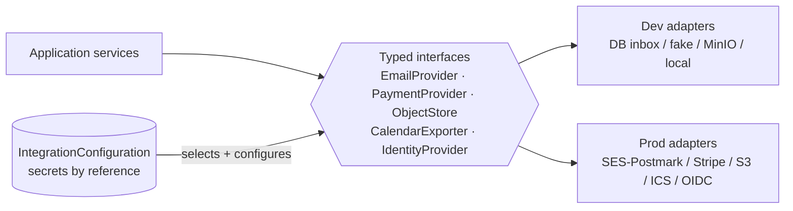

# Integrations: Provider-Adapter Strategy

Every external dependency sits behind a **typed interface** in
`integrations/` with at least two implementations: a **dev adapter** that works
offline with zero credentials, and the intended **production provider**. Application
code depends only on the interface; the concrete adapter is chosen per org via
`IntegrationConfiguration`. This keeps local dev fully self-contained
(`docker compose up` needs no external accounts) and makes providers replaceable
without touching business logic.

## Common rules (all providers)

- **Interfaces are typed** (Python `Protocol` + Pydantic request/response models);
  adapters are constructed by a factory reading `IntegrationConfiguration`, never
  instantiated inline in services.
- **Secrets by reference, never inline.** `IntegrationConfiguration` stores a
  *secret reference* (env var name or secret-manager path), never the value. Config
  API responses and audit diffs show the reference only. No secret in the DB, in
  logs, or in a repo.
- **All outbound calls happen in workers** (driven by outbox events, see
  data-flow.md) — never inside a DB transaction, never on the request path (the one
  exception: presigned-URL generation, which is a local signature, not a network
  call).
- **Failure behavior is defined per provider** below; the defaults are: retry with
  exponential backoff + jitter, classify errors as retryable vs terminal, park after
  N attempts with an observability alert, and never fail the user's original request
  because a provider is down.
- **Inbound webhooks:** signature verified before parsing, replayed safely
  (idempotency key = provider event id, see data-flow.md §4), timestamp-checked
  against replay, and processed by enqueuing work — the webhook endpoint itself does
  minimal validation + insert + 200.
- **Every adapter has a contract test suite** run against the dev adapter and (in
  CI with credentials) against the provider's sandbox, asserting identical
  interface-level behavior.



## 1. Email

**Interface** — `EmailProvider`:

```python
class EmailProvider(Protocol):
    def send(self, msg: OutboundEmail) -> ProviderSendResult: ...
    # OutboundEmail: to, from_(org-configured verified sender), subject,
    #   html_body, text_body, headers (List-Unsubscribe, org tag), send_key
    # ProviderSendResult: provider_message_id, accepted: bool
```

Delivery events arrive separately via webhook → `EmailDeliveryEvent`.

- **Dev adapter:** `LocalInboxEmailProvider` — writes the rendered message to a
  local DB inbox table (browsable at `/dev/mailbox` in dev builds) and/or SMTP to
  the compose-bundled **Mailpit** container. Nothing leaves the machine; "delivered"
  events are synthesized so the delivery pipeline is exercisable offline.
- **Prod provider:** **SES or Postmark** (org choice). Same interface; adapter maps
  provider webhooks (bounce/complaint/delivered, opt-in open/click) to
  `EmailDeliveryEvent`.
- **Failure behavior:** send jobs retry (backoff, max 8 attempts) on 5xx/throttle;
  terminal on invalid-recipient → mark recipient `failed`, emit `delivery.failed`.
  Hard bounces and complaints feed the **suppression list**; suppressed addresses
  are excluded at audience-resolution time, and a send to a suppressed address is a
  no-op with an audit note. A provider outage delays mail; it never loses it
  (outbox holds the intent).
- **Idempotency:** `send_key = (email_recipient_id, purpose)`; the
  `email_recipient` row records the `provider_message_id`, so a retried job that
  already has one exits without re-sending. Delivery webhooks dedup on
  `(provider_message_id, event_type)`.
- **Secrets:** SMTP/API credentials by reference (`EMAIL_PROVIDER_API_KEY` env /
  secret-manager path). DKIM/SPF/domain verification is provider-side setup,
  documented in runbooks, never stored here.
- **Webhook verification:** Postmark — HTTP basic + IP allowlist per their model;
  SES — SNS message signature verification (certificate chain) before processing.
  Unverifiable payloads are rejected 401 and counted (alarm on spikes).

## 2. Payments

**Interface** — `PaymentProvider`:

```python
class PaymentProvider(Protocol):
    def create_checkout(self, intent: DonationIntent) -> CheckoutRef: ...
    # returns provider-hosted checkout URL/session id — card entry NEVER touches us
    def verify_webhook(self, payload: bytes, signature: str) -> ProviderEvent: ...
    def refund(self, provider_charge_id: str, amount: Money,
               idempotency_key: str) -> RefundResult: ...
```

- **Dev adapter:** **Stripe test mode** is the dev default (test keys, test cards) —
  payments are the one integration where the sandbox *is* the dev adapter, because
  faking a PCI boundary teaches the wrong flow. A `FakePaymentProvider` exists only
  for unit tests/CI without network.
- **Prod provider:** **Stripe** (live mode). Checkout is Stripe-hosted; **no card
  data is ever stored, logged, or proxied** (hard non-goal — PCI scope stays with
  Stripe).
- **Reconciliation is webhook-driven.** The redirect back from checkout is UX only;
  a `Donation` becomes `completed` exclusively when the signed
  `checkout.session.completed` / `payment_intent.succeeded` webhook is verified and
  recorded as a `PaymentEvent`, which emits `donation.completed` via the outbox. A
  nightly beat job cross-checks open intents against the Stripe API and flags drift.
- **Failure behavior:** webhook processing failures return 5xx so Stripe retries;
  processing is idempotent so retries are safe. `payment.failed` events notify the
  donor (recurring) and appear in the finance report. Refunds are human-authorized
  (finance manager ◐ with approval / org admin — see permissions.md), executed by a
  worker with a stored `idempotency_key`, audited.
- **Idempotency:** inbound — Stripe `event.id` unique on `payment_event`; outbound —
  Stripe `Idempotency-Key` header on create/refund calls, persisted with the
  Donation so a crashed worker retry reuses the same key.
- **Secrets:** `STRIPE_SECRET_KEY` and `STRIPE_WEBHOOK_SECRET` by reference. The
  publishable key is the only value exposed to the frontend.
- **Webhook verification:** Stripe signature header (`Stripe-Signature`, HMAC over
  timestamped payload) with tolerance window (5 min) against replay; verified
  before any parsing of the body into domain types.

## 3. Object storage

**Interface** — `ObjectStore`:

```python
class ObjectStore(Protocol):
    def presign_upload(self, key: str, content_type: str,
                       max_bytes: int) -> PresignedUpload: ...
    def presign_download(self, key: str, ttl: timedelta) -> str: ...
    def get(self, key: str) -> BinaryIO: ...
    def delete(self, key: str) -> None: ...
```

- **Dev adapter:** **MinIO** in compose (same S3 API — one adapter, two endpoints;
  the "dev adapter" is configuration, not code).
- **Prod provider:** **S3** (or any S3-compatible store).
- **Upload validation pipeline** (mandatory for every upload path — documents,
  work-request attachments, form attachments):
  1. Service issues a presigned PUT constrained by declared `content_type` and
     `max_bytes`; key layout `org/{org_id}/{module}/{uuid}` — org prefix is part of
     the isolation story.
  2. Client uploads directly to storage (never through the API process).
  3. Client calls *finalize*; a worker then validates: **extension allowlist**,
     **declared type vs magic bytes** (server-side sniff of the stored object),
     **size**, and submits to the **malware-scan interface**:

     ```python
     class MalwareScanner(Protocol):
         def scan(self, obj: BinaryIO) -> ScanResult:  # clean | infected | error
     ```
     Dev adapter: `AlwaysCleanScanner` (plus an EICAR-triggered fake for tests);
     prod: ClamAV container or a hosted scanning API.
  4. Only after `clean` does the `Document` row flip to `available`; until then
     the object is not downloadable by anyone. `infected` → object deleted, event
     audited, uploader notified. `error` → retry, then quarantine + alert
     (fail-closed).
- **Failure behavior:** presign is local (no availability dependency); finalize
  validation retries; downloads always via short-TTL presigned URLs — the bucket is
  private, no public ACLs, ever.
- **Idempotency:** finalize is idempotent on the object key; re-scan of an
  `available` document is a no-op.
- **Secrets:** access key/secret by reference; bucket + endpoint are non-secret
  config in `IntegrationConfiguration`.

## 4. Calendar

**Interface** — `CalendarExporter`:

```python
class CalendarExporter(Protocol):
    def ics_feed(self, scope: FeedScope) -> str:        # RFC 5545 document
    def ics_single(self, occurrence: Occurrence) -> str
    def add_links(self, occurrence: Occurrence) -> CalendarLinks  # google/outlook/ics URLs
```

- **Export-only in the initial releases** — no two-way sync, no OAuth to users'
  calendars (that would be a new ADR). This is a pure generator: one production
  implementation, the dev adapter *is* the prod adapter.
- **Feeds:** per-volunteer "my shifts/trainings" feed and per-program/location
  public feeds, served at a **capability URL** containing an unguessable,
  individually revocable token (feed clients can't authenticate; the token *is* the
  credential — rotate on demand, scoped read-only to that feed's content, org-scoped
  like everything else). Single-occurrence `.ics` attachments ride along on
  confirmation emails; "Add to Google/Outlook" links are generated per occurrence.
- **Failure behavior:** feed generation is a read-only render from current state
  (cacheable, short TTL, invalidated by `shift.changed`); a failure returns 503 to
  the calendar client, which polls again. `shift.changed` also bumps `SEQUENCE` on
  the VEVENT so consuming calendars pick up amendments.
- **Idempotency:** stable `UID` per (occurrence, feed) so re-fetches and re-sent
  invites update rather than duplicate.
- **Secrets:** none (feed tokens are per-feed credentials stored hashed, like API
  tokens). No webhooks.

## 5. Identity

**Interface** — `IdentityProvider` (used by the `identity` module's auth service):

```python
class IdentityProvider(Protocol):
    def start_login(self, email: str) -> LoginChallenge: ...
    def complete_login(self, challenge_ref: str, proof: str) -> AuthenticatedIdentity: ...
```

- **Default: magic-link** (passwordless). `start_login` issues a single-use,
  short-lived (15 min), hashed-at-rest token delivered via the **Email** provider
  (through the same outbox pipeline); `complete_login` consumes it exactly once.
  Enumeration-safe: the response is identical whether or not the email exists.
  In dev, the link lands in the local inbox — no external dependency.
- **Optional: password** — per-org flag; argon2id hashing, breach-list check on set,
  standard reset via the magic-link machinery. **MFA (TOTP) required for privileged
  roles** regardless of method (permissions.md).
- **Later: OIDC** — the interface is deliberately shaped so an `OIDCProvider`
  adapter (org-configured issuer, PKCE, `email_verified` claim mapping to Person)
  slots in without touching session handling. Not built until an org needs it (ADR
  first).
- **Failure behavior:** email-provider outage delays magic links (outbox retries);
  auth endpoints are rate-limited per email + per IP; repeated failures trigger
  bot controls. Sessions are server-side records — revocable individually and
  org-wide.
- **Idempotency:** re-requesting a link invalidates prior outstanding links;
  consuming a link is a compare-and-swap (single use under concurrency).
- **Secrets:** session signing keys and (later) OIDC client secrets by reference,
  with documented rotation.
- **Webhooks:** none in the default flow.

## 6. IntegrationConfiguration governance

`IntegrationConfiguration` (domain-model.md, governance) is the single control
point for "which adapter, with what config, for which org":

- **Who:** only **org admin** holds `integrations.manage` (capability matrix:
  "Manage integrations / secrets"). It is a high-risk surface: every create/update/
  disable/rotation emits an `AuditEvent` with before/after digests — with secret
  values redacted to their references.
- **What it stores:** provider selection per capability (email/payments/storage/
  calendar/identity), non-secret settings (sender domain, bucket, webhook
  endpoints), the **secret reference**, an enabled flag, and a health status
  updated by a periodic connectivity probe per adapter.
- **Validation on save:** the adapter's `verify()` probe runs before activation
  (send a test email to the admin, ping the bucket, fetch Stripe account info);
  a failing probe blocks enablement rather than failing at first real use.
- **Change safety:** switching providers never rewrites history — old
  `provider_message_id`s / charge ids keep their original provider context on the
  rows that recorded them. Adapters are resolved per job execution, so in-flight
  outbox events pick up the new provider on their next attempt.
- **Never via MCP:** integration configuration and secret references are explicitly
  outside the MCP surface (see mcp-design.md) — no tool reads or writes them.
