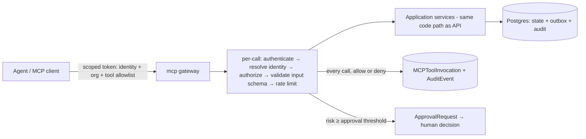

# Governed MCP Interface

The `mcp` deployable exposes platform capability to agents and MCP clients. It is a
**governed, narrow surface over application services** — not a proxy for the API.

## Core rule

**Do not expose every internal API endpoint.** MCP offers a small set of
**task-oriented tools** ("register a guest for this session"), each mapped to one
application-service operation, each carrying its own authorization, risk
classification, and audit contract. Everything a tool does runs through the same
`authorize(actor, action, resource)` service and org-scoped repositories as the API
(permissions.md) — a tool being *available* never implies permission (non-goals).

Never exposed via MCP, under any configuration:

- raw database access (SQL, ORM, migrations);
- shell, filesystem, or Docker socket;
- secrets, secret references, or `IntegrationConfiguration`;
- payment credentials or refund/charge execution;
- email master credentials or raw provider send (only template-bound,
  policy-bound tools);
- **cross-org search or any operation not scoped to exactly one `org_id`**;
- permission/role management, user impersonation, record deletion, person merge —
  the full high-risk list in permissions.md stays human-only.



## Identity, tokens, attribution

- Every MCP client authenticates with a **scoped API token**: bound to one org, one
  identity, an explicit tool/resource allowlist, an expiry, and revocable at any
  time (`MCPClient` in the domain model). Tokens are stored hashed.
- Identity is one of: **human** (delegated — the tool acts *as* that user, with that
  user's scoped roles, never more), **service**, or **agent** (an agent-plane
  identity with an explicit capability allowlist per agents/agent-permissions.md).
  Delegated identity can only *narrow* the human's permissions, never widen them.
- **Every MCP action is attributable**: each call — allowed or denied — writes an
  `MCPToolInvocation` (client, identity, tool, input digest, outcome, latency) and
  every write lands an `AuditEvent` in the same transaction as the state change,
  with `actor = {kind: agent|service|user-delegated, id, mcp_client_id}`. There is
  no anonymous MCP action.
- Denials on privileged tools are logged and alarmed (same policy as the API).

## Read-only resources

Exposed as MCP *resources* (read-only, org-scoped, permission-filtered — a client
sees a resource only if its identity could read the same data in the app):

| Resource | Content | Notes |
|---|---|---|
| `org-config` | org name, terminology map, enabled modules, public policies | never feature-flag internals or secrets |
| `public-opportunities` | published volunteer opportunities / open shifts | public data only |
| `training-catalog` | published courses + upcoming sessions, capacity remaining | drives `register_training_guest` |
| `event-summaries` | upcoming events/shifts with staffing status | scoped to identity's visibility |
| `handbook` | published volunteer handbook pages | published `ContentPage`s only |
| `program-policies` | program rules, eligibility, cancellation policies | |
| `approved-comm-templates` | approved `EmailTemplate`s (name, variables, purpose) | templates only — never recipient data |
| `maintenance-runbooks` | published maintenance procedures/checklists | |
| `asset-summaries` | asset registry summaries + open-work-request counts | no location-sensitive detail below identity's scope |
| `metric-definitions` | canonical definitions of reported metrics | keeps agent reporting honest |
| `announcements` | published `Update`s the identity's audience includes | |
| `api-workflow-docs` | how-to docs for platform workflows and this MCP surface | |

Resources are served from the same cached read paths as the app (data-flow.md §7),
org-prefixed, and never include PII beyond what the identity's role could see.

## Tools

Grouped by module. Read tools return summaries/aggregates, not bulk PII exports.
Write tools follow the contract template below.

**Scheduling** — `list_open_shifts`, `get_shift_detail`, `draft_shift_plan`
(proposal only), `flag_understaffed_shift`, `suggest_volunteer_matches`
(suggestions from declared availability/qualifications — assignment stays human).

**Training** — `list_training_sessions`, `get_session_roster_summary` (counts +
statuses, not contact details), `register_training_guest` (fully specified below),
`promote_waitlist_candidate` (fully specified below), `record_attendance_checkin`
(trainer-delegated identity only).

**Communications** — `draft_communication` (creates a *draft* from an approved
template — never sends), `preview_audience_count` (count only, no recipient list),
`schedule_approved_communication` (only for a communication that already carries a
human approval), `get_delivery_summary`.

**Maintenance** — `create_work_request`, `get_work_request_status`,
`draft_triage_suggestion` (proposal only), `list_overdue_maintenance`.

**Volunteer ops** — `get_volunteer_status_summary` (aggregate, no PII),
`log_volunteer_hours` (delegated identity, own hours or coordinator scope),
`list_expiring_qualifications`, `draft_onboarding_reminder`.

**Reporting** — `get_training_metrics`, `get_shift_fill_rates`,
`get_maintenance_backlog_summary`, `get_donation_totals` (aggregates only — no
donor-level records; those are finance-role app surface, not MCP).

Deliberately absent: send/approve bulk comms, refunds, role changes, deletion,
merge, publishing — the high-risk list is human-only by design, not by omission.

## Tool contract template

Every write-capable tool ships with this contract, versioned next to its
implementation and enforced by the gateway (not by convention):

```yaml
tool: <name>                      # stable wire name — renames are breaking changes
summary: <one sentence, task-oriented>
authorization:
  required_permission: <permission string from permissions.md>
  scope: <org | program | team | location | own-sessions | self>
  identity_kinds: [user-delegated, service, agent]   # who may call it
risk_level: low | medium | high    # high ⇒ never agent-autonomous (non-goals)
approval_required: true | false | policy:<org-policy-key>
reversible: true | false           # and the compensating action if true
idempotency: <key derivation; behavior on replay>
input_schema: <Pydantic/JSON-Schema ref — strictly validated, unknown fields rejected>
output_schema: <Pydantic/JSON-Schema ref — minimal; no incidental PII>
audit_event: <action name recorded in AuditEvent, same TX as the write>
rate_limit: <per-identity and per-org ceilings>
org_scope: single-org, from token; cross-org input is a validation error
data_classification: <public | internal | pii | sensitive>  # highest data touched
failure_behavior: <typed errors; retry safety; what the caller must not assume>
```

Gateway enforcement order: token valid → identity resolved → `authorize()` →
schema validation → rate limit → (if `approval_required`) create
`ApprovalRequest` and return `pending_approval` instead of executing → execute via
application service → audit. A tool without a complete contract does not register.

## First-slice tool contracts

### `register_training_guest`

```yaml
tool: register_training_guest
summary: Register a guest (Person, no login required) for a published training session.
authorization:
  required_permission: training.register_guest
  scope: org (session must belong to token org and be public + published)
  identity_kinds: [user-delegated, service, agent]
risk_level: low            # public self-serve action; no privileged data exposed
approval_required: false
reversible: true           # compensating action: registration cancel flow
idempotency: >
  natural key (session_id, normalized email). Replay or duplicate returns the
  existing registration (created=false) — never a second registration, never a
  second verification email (send_key dedup, data-flow.md §4).
input_schema: >
  { session_id: uuid, given_name: str(1..100), family_name: str(1..100),
    email: EmailStr, phone?: E164, consent: {terms: true, contact_purpose: str} }
  Unknown fields rejected. Consent is required, not defaulted.
output_schema: >
  { registration_id: uuid, status: registered|waitlisted, created: bool,
    verification: pending, capacity_state: open|waitlist, next_step:
    "verification email sent" }   # no other attendees' data, ever
audit_event: training.registration.created (actor = MCP identity, same TX)
rate_limit: 10/min per identity; 60/min per org; shares the public-form
  bot-control budget so MCP cannot be a bulk-registration bypass.
org_scope: single-org from token; session_id resolved under org filter (a foreign
  session id behaves exactly like a nonexistent one).
data_classification: pii (name, email, phone of the guest being created)
failure_behavior: >
  Typed errors: session_not_found | session_not_open | validation_error |
  rate_limited. Capacity-full is NOT an error — the tool returns waitlisted (same
  deterministic seat/waitlist logic as the API, under the session capacity lock).
  Email delivery is async via outbox; the tool never blocks on, nor reports,
  provider status. Safe to retry on transport failure (idempotent).
```

### `promote_waitlist_candidate`

```yaml
tool: promote_waitlist_candidate
summary: Promote a specific waitlist entry into a confirmed seat for a training
  session, subject to capacity and waitlist-order policy.
authorization:
  required_permission: training.manage_session
  scope: own-sessions (trainer) or program (coordinator) — object-level check that
    the identity manages this session; delegated identity required for agents by
    default (the agent acts for a named human)
  identity_kinds: [user-delegated, agent]
risk_level: medium         # affects a real person's seat and triggers email
approval_required: policy:training.auto_promote
  # default TRUE → creates an ApprovalRequest for the session owner/coordinator
  # and returns pending_approval. An org MAY enable the narrow auto-promote
  # policy (OrganizationSetting training.auto_promote), which waives approval
  # ONLY when ALL hold: candidate is waitlist position #1, a seat is genuinely
  # free, promotion follows the entry's snapshotted promotion policy, and the
  # session is not flagged restricted. Out-of-order promotion ALWAYS requires
  # human approval regardless of the policy flag.
reversible: true           # compensating action: cancel the promoted registration
  (seat returns, waitlist re-evaluates); the sent "approved" email is not
  recallable — which is why this is medium-risk, not low.
idempotency: >
  key = (waitlist_entry_id, target: confirmed). Entry already promoted → no-op
  success referencing the existing registration; no duplicate email (promotion-id
  send_key). Entry cancelled/stale → typed conflict error, no side effects.
input_schema: >
  { session_id: uuid, waitlist_entry_id: uuid, reason?: str(..500) }
  reason is required when the candidate is not position #1 (it becomes part of
  the ApprovalRequest and the audit record).
output_schema: >
  { outcome: promoted | pending_approval | noop_already_promoted,
    registration_id?: uuid, approval_request_id?: uuid, position_was: int }
audit_event: training.waitlist.promoted (auto path) or
  approval.requested → training.waitlist.promoted on human approval; both carry
  the MCP identity, and the approval carries the approving human. Same-TX as the
  state change (data-flow.md §8.7).
rate_limit: 6/min per identity; 30/min per org (promotions are singular acts, not
  batch operations — bulk promotion is not an MCP capability).
org_scope: single-org from token; session and entry resolved under org filter and
  must belong to the same session.
data_classification: pii (candidate identity within roster context)
failure_behavior: >
  Typed errors: entry_not_found | entry_stale | no_seat_available |
  policy_violation | authz_denied (logged + alarmed) | rate_limited.
  Runs under the session capacity lock with the DB capacity constraint as the
  backstop (data-flow.md §3): a lost race returns no_seat_available and changes
  nothing. pending_approval is a terminal success for the tool call — the caller
  must not retry it into a second ApprovalRequest (idempotent on the entry).
  Confirmation email is async via outbox.
```

## Operational guardrails

- **Rate limits and quotas** per token and per org, with anomaly alerts (a spike in
  tool calls from one client is an incident signal).
- **Kill switch:** org admin can disable an `MCPClient` or the whole MCP surface
  per org instantly; in-flight approvals survive, new calls 403.
- **Contract tests:** every tool's contract (authz, idempotent replay, org-boundary
  rejection, approval path) has automated tests; the org-boundary test — calling
  with a valid id from another org — is mandatory for every tool.
- **Prompt-injection posture:** resource content and tool outputs are data, never
  instructions (system-design §5); the gateway never lets tool output alter a
  client's allowlist or identity.
