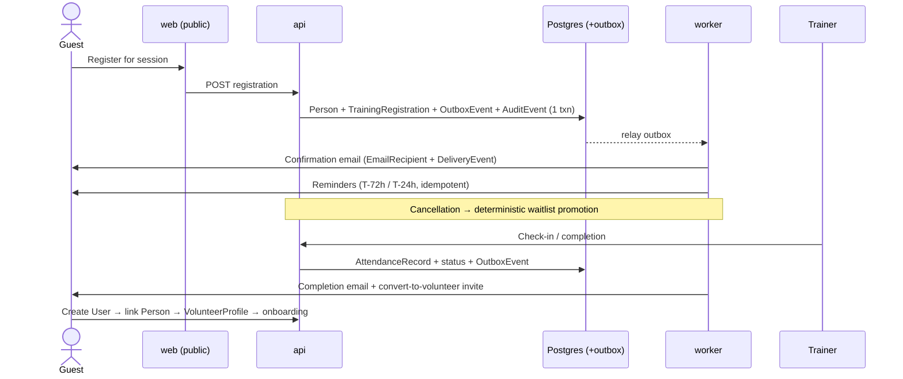
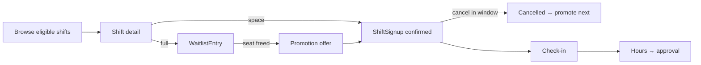

# User Journeys

Each journey ends with the **volunteer-first questions** it must answer:
*What's happening? Am I eligible? When/where? What to bring/complete? Who to contact?
What's my next action?* Entity names refer to [domain-model.md](../architecture/domain-model.md);
capabilities to [permissions.md](../architecture/permissions.md). All email side effects
go through the transactional outbox — never sent inside a request handler.

---

## A. Public training registration → conversion (first vertical slice)

The reference journey. Guest-capable by design: registration binds to a **Person**,
not a User account (progressive enrollment stages 1–3; conversion is stage 4+).

1. **Discover.** Visitor browses public Courses and upcoming TrainingSessions
   (SSR public pages: date, location, capacity remaining, prerequisites, cost,
   accessibility info, cancellation policy).
2. **Register (guest).** Visitor submits name + email (+ phone optional). System
   finds-or-creates a **Person**, creates a **TrainingRegistration**
   (status `registered`), and in the same DB transaction writes an
   **OutboxEvent** (`training.registration.created`) and an **AuditEvent**.
   Rate limiting + bot controls apply; duplicate registration for the same
   session/person is rejected idempotently.
3. **Confirm.** Worker relays the OutboxEvent → renders the confirmation
   **EmailRecipient** (content snapshot stored) → provider send →
   **EmailDeliveryEvent** recorded. Email contains session details and a
   verification/manage link; verifying moves the registration's verification state
   forward and lets the guest self-cancel later.
4. **Remind.** Scheduler (beat) enqueues reminder jobs at configured offsets
   (e.g. T-72h, T-24h). Each reminder is an idempotent job → EmailRecipient with
   what-to-bring, location/map, and contact info. This is inside the agent
   auto-reminder allowlist — no human approval needed, no sensitive content.
5. **Waitlist.** If the session is at capacity at step 2, the registration is
   created with status `waitlisted` plus a **WaitlistEntry** (position + promotion
   policy snapshot). The guest is told their position and what happens next.
6. **Promotion.** A cancellation emits `training.registration.cancelled` → worker
   applies the deterministic promotion policy (ordinary tested code, never AI):
   top WaitlistEntry → registration status `registered`/`confirmed`, promotion
   email with a confirm-by deadline; on expiry, the seat rolls to the next entry.
   Every promotion writes an AuditEvent.
7. **Check-in.** At the session, the Trainer (scoped: `training.record_attendance`)
   checks people in by roster tap or QR → **AttendanceRecord** (method recorded);
   no-shows marked `no_show`.
8. **Completion.** Trainer records completion (`training.record_completion`) →
   registration status `completed`, AttendanceRecord completion set, certificate
   ref stored, and — if the Course maps to a QualificationType — a
   **VolunteerQualification** is granted when/once a VolunteerProfile exists.
   OutboxEvent `training.completed` → completion email.
9. **Convert.** Completion email invites the guest to become a volunteer: create a
   **User** (magic link — email already verified in step 3), attach it to the
   existing Person, create a **VolunteerProfile**, and enter the onboarding
   pipeline (Journey B) with training history and qualifications already attached.
   Nothing is re-entered; this is why Person ≠ User.

**Volunteer-first answers:** What's happening = session page & confirmation email.
Eligible = prerequisites shown pre-registration; capacity/waitlist state explicit.
When/where = every email + manage page. Bring/complete = reminder emails.
Contact = instructor/org contact in confirmation. Next action = always one: verify →
attend → complete → convert.

---

## B. Prospective → active volunteer onboarding

1. Person submits interest (public form) or arrives via Journey A conversion →
   VolunteerProfile created in the org's configured entry status.
2. An **OnboardingRecord** is created against the org's configured
   **OnboardingPipeline** (stages are org config, not code).
3. Volunteer sees a checklist: each **OnboardingStage** shows done/next/blocked,
   with the action attached (upload Document, complete a FormSubmission, attend a
   required training via Journey A, provide ConsentRecord).
4. Stage completions advance the record automatically where verifiable (e.g.
   training completed); staff-verified stages queue for a coordinator/admin.
5. Blockers are visible to both sides; reminder emails (outbox) nudge stalled records.
6. Final stage → profile status becomes active; welcome email with "find your first
   shift" (Journey C). AuditEvent on every status change.

**Volunteer-first answers:** the OnboardingRecord *is* the answer surface — current
stage (what's happening), remaining requirements (what to complete), stage owner
(who to contact), and exactly one highlighted next action.

---

## C. Volunteer finds & signs up for a shift (+ cancel / waitlist)

1. Volunteer opens Opportunities: Shifts filtered by **eligibility** (ShiftRole
   required QualificationTypes / age / program rules vs. own VolunteerQualifications)
   and own AvailabilityRules. Ineligible shifts show *why* and how to become eligible
   (e.g. "requires Chainsaw Safety — next session →" linking to Journey A).
2. Shift detail: time (tz-aware), location, role descriptions, staffing state,
   what-to-bring, contact.
3. Sign up → **ShiftSignup** (role capacity checked transactionally) + OutboxEvent →
   confirmation email; reminders per org policy.
4. Full role → offer **WaitlistEntry**; promotion on cancellation is the same
   deterministic mechanism as Journey A step 6.
5. Cancel → within policy window, self-serve; OutboxEvent notifies the coordinator
   and triggers waitlist promotion. Late cancels flagged to coordinator, not blocked.
6. Attend → check-in → hours recorded on the signup → VolunteerHourEntry →
   coordinator approval (Journey D world).

**Volunteer-first answers:** eligibility is computed and explained, not discovered by
rejection; when/where/bring on the detail page and reminders; contact = shift
coordinator; next action = sign up / confirm promotion / check in.

---

## D. Coordinator staffs an understaffed shift

1. `shift.understaffed` domain event (staffing below min at a configured horizon)
   surfaces the shift on the coordinator's dashboard (program/team scope only).
2. Coordinator opens the gap: which ShiftRoles are short, by how many.
3. System lists **eligible, available** candidates (deterministic: qualifications +
   AvailabilityRules + workload counters). An agent may rank or draft outreach —
   proposals only (**AgentProposal**), separation of confidence from authority.
4. Coordinator picks people → sends invites (drafted comms to program audience is
   within coordinator scope) or directly assigns (`Assign volunteers`, ◐ scoped).
5. Direct assignment notifies the volunteer, who can decline within policy.
6. Filled → event clears; still short at cutoff → escalation per org policy
   (broader eligible audience, or flag to org admin). All assignments audited.

**Volunteer-first answers (for the invited volunteer):** invite states what/when/
where/why-me (eligibility), and one action: accept or decline.

---

## E. Public maintenance report → triage → assign → close with evidence

1. Reporter (public form ◐, or any logged-in role) submits: location/asset (QR or
   short-code prefill), category, severity, description, photos. Anonymous allowed;
   contact optional for follow-up. Rate-limited.
2. **WorkRequest** created (status `reported` → `needs_triage`) + OutboxEvent
   notifies the maintenance coordinator + AuditEvent.
3. **Triage** (maint coordinator scope): validate, de-duplicate (→ `duplicate`),
   set severity/impact/due, approve or reject with reason (reporter notified if
   contactable).
4. **Assign:** **WorkAssignment** to an owner/team; required skills/parts noted;
   status walks the org-configured workflow (`scheduled → in_progress → blocked /
   waiting_parts / waiting_vendor` as reality dictates).
5. **Complete:** assignee adds resolution notes + evidence (photos) + hours →
   `ready_for_verification`.
6. **Close:** coordinator verifies evidence → `closed`; maintenance hours →
   VolunteerHourEntry (maint-coordinator approval); Inspection follow-ups linked;
   reporter gets a closure note if contactable.

**Volunteer-first answers (assignee):** what's happening = the request record;
when/where = due + asset location; bring/complete = required skills/parts +
checklist; contact = coordinator; next action = current workflow status.

---

## F. Comms manager: draft → preview audience → approval → schedule

1. Draft an **EmailCampaign** from an **EmailTemplate** (declared variables
   validated; footer/unsubscribe enforced).
2. Build the **EmailAudienceDefinition** — explicit filters, never an implicit list.
3. **Preview:** resolved count + sample recipients + rendered sample. Suppression
   list and SubscriptionPreferences already excluded at preview time, so the number
   shown is the number sent.
4. **Approval gate:** within configured policy thresholds (size/audience/
   sensitivity) the comms manager approves (◐ per matrix); above threshold →
   ApprovalRequest to org admin. **Approve & send bulk is never agent-autonomous.**
5. **Schedule** (tz-aware) → status `scheduled`.
6. Worker resolves audience at send time → **EmailRecipient** rows (rendered
   snapshot each) → provider send → **EmailDeliveryEvents** (bounces/complaints
   feed suppression). Pause/cancel available until send; all transitions audited.

**Volunteer-first answers (as recipient):** every campaign carries why-you-got-this
(audience/topic), the concrete next action, a contact, and working preference
management.

---

## G. Donation — one-time & recurring, with receipt

1. Donor (public, guest-capable) opens the donate page or a **DonationCampaign**
   page (goal/progress if the campaign is public).
2. Chooses amount (suggested or custom), designation, one-time vs recurring, and
   optional anonymity. Card details go **only** to the payment provider's hosted
   fields — never our servers (non-goal: no card data, ever).
3. **Donation** record created with provider intent id; provider processes payment.
4. Provider webhook → **PaymentEvent** (signature-verified, idempotency-keyed,
   replay-safe) → donation reconciled → OutboxEvent → **receipt email**
   (EmailRecipient snapshot). Receipt state tracked on the Donation.
5. **Recurring:** each provider cycle emits a webhook → new Donation/PaymentEvent →
   receipt. Payment failure → `donation.payment_failed` event → dunning email with
   provider-hosted update-payment link; donor can cancel recurrence self-serve.
6. Finance manager sees records/reports (Finance scope only); refunds ◐ with
   approval; accounting export — no GL inside the platform (non-goal).

**Volunteer-first answers (donor):** what's happening = campaign page + receipt;
next action = clear on every email (update payment / manage recurrence); contact =
finance contact on receipts.
